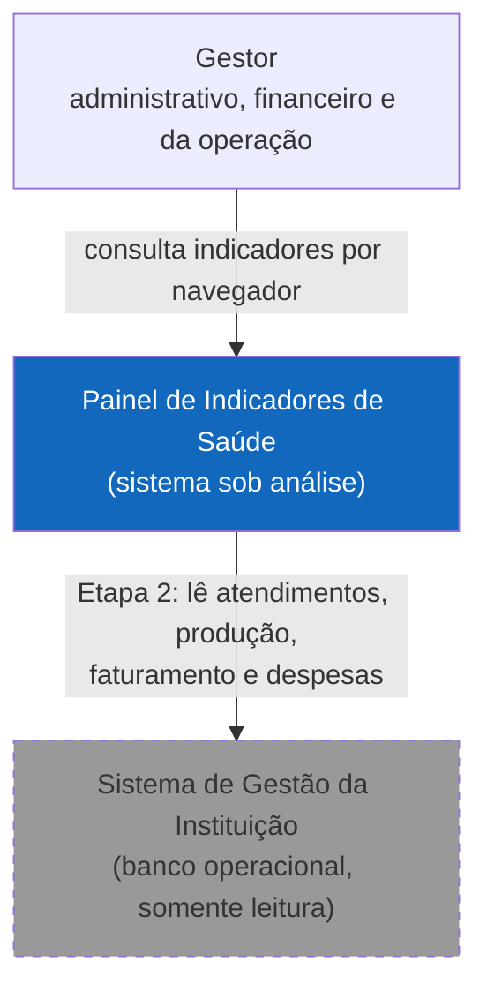
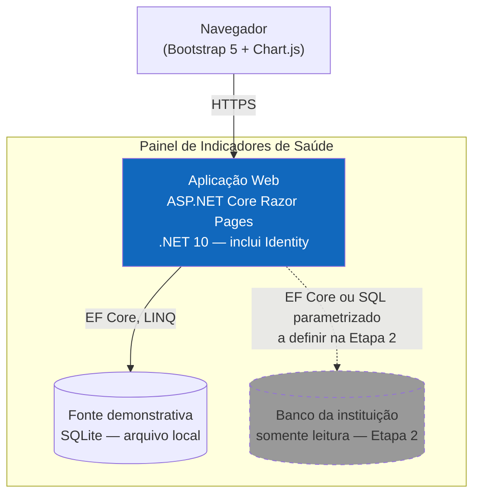
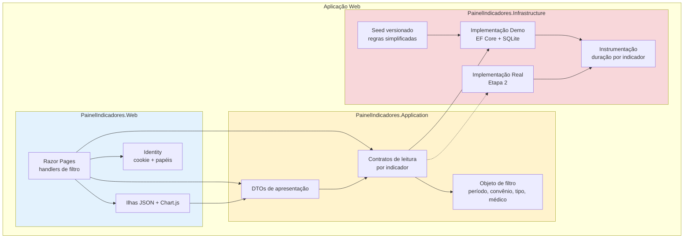
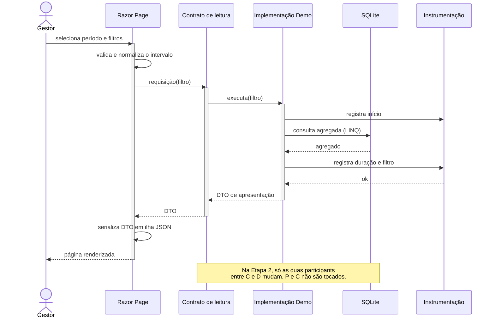
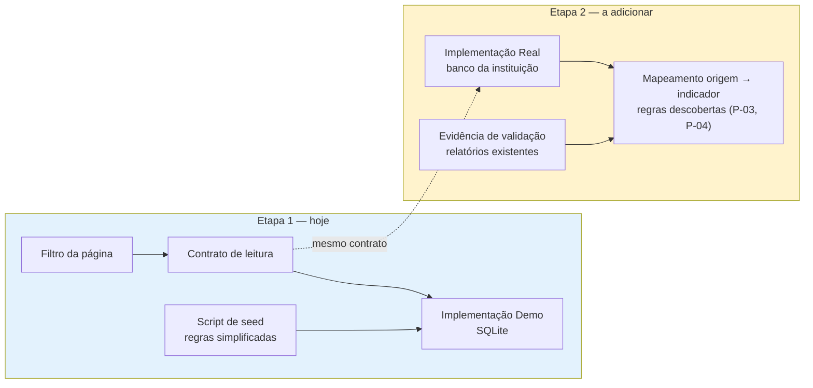

# Proposta Arquitetural — Painel de Indicadores de Saúde

> Cliente: projeto de laboratório (autoral) · Documento gerado em 2026-09-26 · Versão 0.1

---

## 1. Sumário executivo

Estamos construindo um **painel web de indicadores gerenciais para um serviço de saúde** — atendimentos, consultas, exames, produtividade médica, faturamento por convênio, faturamento particular e despesas — apresentados em gráficos, cards e tabelas, com filtros por período e comparação entre períodos.

**Por que esta arquitetura.** O sistema vai ler de um banco real que ainda não foi acessado, cujas regras de cálculo ninguém escreveu. A decisão que organiza tudo é: **os indicadores são definidos uma única vez, como contratos de leitura independentes de onde os dados moram.** A interface e as regras de apresentação nunca aprendem o nome de uma tabela. Hoje elas conversam com uma fonte demonstrativa em SQLite; quando o banco real aparecer, entra um segundo adaptador ao lado do primeiro, e a interface não muda. Isso é o que permite construir a primeira versão funcional agora sem descartar trabalho quando a descoberta do banco começar.

**Segunda decisão:** acesso somente leitura é garantido **pelo banco** (permissão `SELECT` apenas), não por disciplina do time. Regra que depende de disciplina não é regra.

**Estado atual — e o que isso significa.** Não há banco, não há acesso à rede da instituição, não há contrato, e o projeto roda no notebook do autor. Esta proposta entrega a **Etapa 1** (aplicação funcional sobre dados demonstrativos, com as regras simplificadas e declaradas como simplificadas) e deixa a **Etapa 2** (integração com o banco real) especificada em arquitetura, mas dependente de descobertas que só acontecem com acesso autorizado.

**Principais riscos:**

- O banco real pode obrigar a reescrever as consultas. A mitigação é uma disciplina de escrita: consultas de indicador em LINQ, sem SQL específico de SGBD. O ponto mais frágil dessa disciplina é agrupamento de datas — está registrado como risco, com a causa concreta.
- Os dados demonstrativos podem virar falso padrão de negócio. Mitigação: marcação visível de origem demonstrativa na interface e regra versionada em script, nunca em código.
- O desempenho da fonte demonstrativa **não valida** as metas de desempenho declaradas. Um SQLite com poucos registros responde em milissegundos independentemente de a consulta estar boa. As metas só serão testáveis na Etapa 2.

**Sem custos, prazos ou esforço nesta proposta.** O cliente declarou não haver prazo comercial obrigatório. Ver seção 12.

---

## 2. Contexto e objetivos de negócio

### 2.1 Problema

Hoje, os dados existem no sistema de gestão da instituição, mas não estão disponíveis de forma consolidada. Obter esses números exige consultas separadas ou relatórios separados, o que torna cara e lenta a leitura da operação como um todo. **Não existe especificação consolidada de como cada indicador é calculado** — as regras estão dispersas em relatórios, consultas ad hoc e no conhecimento de quem opera o sistema.

A dor tem duas faces, e é importante não confundi-las:

- **Dor gerencial (o que esta proposta resolve):** o gestor não consegue ver volume de atendimento, produção médica, desempenho de convênios, faturamento e despesas em um lugar só, com filtro de período.
- **Dor de especificação (o que esta proposta não resolve, e registra como descoberta):** ninguém sabe, com precisão, como cada indicador é calculado. Isso não é problema de software — é conhecimento de negócio ausente.

### 2.2 Objetivos de negócio

- Oferecer visão consolidada dos 7 grupos de indicadores em um dashboard responsivo, navegável por filtro de período e por categoria relevante.
- Permitir identificação de tendências, concentrações, variações e pontos de atenção, com comparação entre períodos.
- Manter as **regras de cálculo de cada indicador explícitas, versionadas e substituíveis**, de modo que a descoberta do banco real substitua uma premissa demonstrativa sem reescrever a aplicação.
- Entregar uma primeira versão funcional navegável cedo, e evoluí-la em seguida, sem antecipar complexidade de produto comercial.

### 2.3 Não-objetivos

O cliente foi explícito. **Não** é objetivo deste sistema:

- substituir o sistema de gestão clínico-financeiro;
- executar operação transacional, ou escrever, alterar ou excluir qualquer dado no banco existente;
- gerar documento fiscal, prontuário eletrônico, prescrição, agendamento ou faturamento transacional;
- funcionar offline ou oferecer aplicativo mobile nativo;
- processar em tempo real de segundos;
- apresentar dado clínico identificável de paciente;
- ser produto multi-instituição / SaaS multi-tenant;
- antecipar infraestrutura de produção (IIS, Windows Service, Linux, Docker) — decisão adiada até existir ambiente.

### 2.4 Usuários e cargas esperadas

- **Perfis:** gestores administrativos, gestores financeiros e responsáveis pela operação de saúde. O perfil técnico (gestor financeiro vs. responsável clínico) está mapeado, mas **granularidade de permissão não é requisito inicial**.
- **Dados exibidos:** agregados. Dados individuais de médicos e valores de repasse são tratados como informação de acesso restrito.
- **Carga:** premissa de **dezenas de usuários concorrentes**, histórico de **vários anos**. Ambas explicitamente não validadas — ver seção 4.2.
- **Padrão de uso:** consulta sob demanda, navegação entre visualizações e aplicação de filtros. Não há requisito de dashboard aberto continuamente com auto-refresh.

---

## 3. Atributos de qualidade prioritários

A ordem reflete o que muda de verdade o desenho **hoje**, com as restrições atuais.

### 3.1 Manutenibilidade e extensibilidade — prioridade máxima

- **Meta concreta:** um indicador novo (grupo, recorte ou cálculo) entra sem tocar em código de interface existente; uma mudança de regra de cálculo de um indicador acontece em um único lugar, com o resto do sistema ciente.
- **Por que é prioritário:** as regras de negócio são desconhecidas e vão ser descobertas em etapas futuras. Um sistema cuja interface carrega a fórmula do indicador vai quebrar em cada discovery. É o atributo que decide o resto.
- **Como a arquitetura atende:** contratos de leitura por indicador na camada de Application, com implementações de fonte separadas na camada de Infrastructure (ADR-002).

### 3.2 Portabilidade da fonte de dados

- **Meta concreta:** trocar a fonte demonstrativa pela fonte real não altera camada de interface nem regras de apresentação. O custo é zero mudança em código de UI.
- **Por que é prioritário:** é requisito explícito do cliente, e é a razão de a Etapa 1 não ser trabalho jogado fora.
- **Como a arquitetura atende:** a mesma separação do item 3.1, mais uma disciplina de escrita de consulta que não amarra as consultas a um SGBD (ADR-003).

### 3.3 Segurança e privacidade

- **Meta concreta:** nenhum segredo no repositório; nenhum dado de paciente na interface; caminho de acesso individual a dados de profissionais protegido por perfil, desde a Etapa 1.
- **Por que é prioritário:** os dados são de saúde e involve dado pessoal de profissionais. Mesmo em laboratório, o hábito de trabalho precisa ser o correto — é o material de aprendizado.
- **Como a arquitetura atende:** autenticação e autorização por ASP.NET Core Identity com papéis (ADR-005); somente leitura imposto no banco (ADR-004); segredos fora do versionamento (ADR-004).

### 3.4 Performance — medida, ainda não otimizada

- **Meta concreta declarada:** tela com dados disponíveis em cache até 3 s; consultas usuais e aplicação de filtros até 10 s; consultas históricas amplas podem exceder, com indicação visual de carregamento e tratamento de timeout. **Metas a revisar quando o volume real for conhecido.**
- **Por que é prioritário, mas não dominante:** é meta do cliente, porém ele registrou explicitamente que não quer antecipar cache ou pré-agregação sem evidência.
- **Como a arquitetura atende:** instrumentação de duração por indicador desde a primeira versão, para que a Etapa 2 decida com medição em vez de palpite (ADR-007). **A fonte demonstrativa não produz medição válida** — ver risco R-01.

---

## 4. Restrições

### 4.1 Restrições declaradas

Tudo aqui é dado, não escolha. A coluna "Origem" distingue o que o cliente impôs do que o meio técnico impôs.

| Categoria | Restrição | Origem |
|---|---|---|
| Stack | C# / ASP.NET Core / .NET | Cliente impôs |
| Stack | Razor Pages | Cliente impôs |
| Stack | Bootstrap 5 | Cliente impôs |
| Stack | JavaScript apenas quando necessário para interatividade e visualização | Cliente impôs |
| Stack | **Sem React ou outro framework frontend SPA** | Cliente impôs |
| Ambiente | Visual Studio Code, Windows, PowerShell, Git | Cliente |
| Stack | Alvo .NET 10 LTS (SDK 10.0.204 e runtime ASP.NET Core 10.0.8 presentes na máquina) | Verificado no ambiente |
| Dados | Banco existente em acesso **somente leitura**; sem DDL, sem DML, sem tabela de apoio | Cliente impôs |
| Dados | Segredos e credenciais fora do código e fora do Git | Cliente impôs |
| Dados | Nenhum nome de tabela, coluna, relacionamento ou regra do banco real pode ser inventado | Cliente impôs |
| Dados | Relatórios existentes são **evidência de validação**, não regra de negócio | Cliente definiu |
| Negócio | Indicadores agregados; sem dado clínico identificável de paciente | Cliente definiu |
| Negócio | Dados de médicos e valores de repasse: acesso restrito | Cliente definiu |
| Organizacional | Desenvolvedor único e responsável pela manutenção | Cliente declarou |
| Organizacional | Sem prazo comercial obrigatório | Cliente declarou |
| Regulatório | Sem política institucional de LGPD, auditoria ou autenticação corporativa disponível | Cliente declarou |
| Infraestrutura | Nenhuma infraestrutura de produção disponível; hosting indefinido | Cliente declarou |
| Integração | Sem conexão, VPN ou remote desktop com ambiente da instituição | Cliente declarou |

### 4.2 Premissas e requisitos de descoberta

O cliente autorizou explicitamente Advance com premissas, sinalizando-as. Nenhuma linha abaixo é uma definição: são **suposições que ainda precisam ser confirmadas**, e cada uma tem um momento e um responsável de confirmação.

| # | Premissa / pendência | Tipo | Quando confirmar | Como confirma |
|---|---|---|---|---|
| P-01 | SGBD do banco real (SQL Server, PostgreSQL, MySQL, Oracle…) | Descoberta | Etapa 2, início | Consulta a metadados com acesso autorizado |
| P-02 | Existência de esquema, tabelas e relacionamentos | Descoberta | Etapa 2 | Inspeção de metadados |
| P-03 | Origem de cada um dos 7 grupos de indicadores | Descoberta | Etapa 2 | Mapeamento origem → indicador |
| P-04 | Regra de cálculo real de cada indicador | Descoberta | Etapa 2 | Leitura de relatório existente como evidência + validação numérica contra o dado |
| P-05 | Códigos e classificações (tipo de atendimento, convênio, sexo) | Descoberta | Etapa 2 | Leitura de tabelas de domínio e confrontação com o exibido pelo sistema de gestão |
| P-06 | Volume real de dados e volume de usuários concorrentes | Premissa | Etapa 2 | Medição no ambiente real |
| P-07 | Latência real das consultas agregadas sobre o banco operacional | Premissa | Etapa 2 | Medição — **é o que decide toda a estratégia de performance** |
| P-08 | Existência de chave primária utilizável e estabilidade do schema | Descoberta | Etapa 2 | Inspeção de metadados |
| P-09 | Especialista de negócio disponível para validar as regras descobertas | Premissa | Etapa 2, antes da validação | Confirmação com a instituição |
| P-10 | Ambiente de hospedagem definitivo | Premissa | Pós-Etapa 1 | Decisão no momento em que houver ambiente |

**Regra de ouro do projeto:** enquanto P-01 a P-05 e P-08 não estiverem confirmadas, **nenhuma decisão deste documento sobre acesso a dados pode ser tratada como definitiva**. A Etapa 1 é explícita e assumidamente provisória nesse trecho.

---

## 5. Decisões arquiteturais (ADRs resumidos)

### ADR-001: Monolito em camadas .NET 10 com Razor Pages, sem mediator e sem camada de domínio separada

- **Contexto:** aplicação interna de leitura sobre dados, um desenvolvedor, sem necessidade de escala horizontal. O cliente restringiu a stack a Razor Pages e excluiu explicitamente SPA. O catálogo de estilos arquiteturais indica **monolito em camadas** como isomórfico a "aplicações administrativas internas" com time de 1 a 10 devs.
- **Decisão:** solução única em três projetos — `PainelIndicadores.Web` (Razor Pages, Bootstrap 5, JavaScript de visualização), `PainelIndicadores.Application` (contratos de leitura, DTOs, objeto de filtro) e `PainelIndicadores.Infrastructure` (EF Core, implementações da fonte de dados, seed) — mais `PainelIndicadores.Tests`. Razor Pages renderiza no servidor; sem build step de frontend e sem pasta de assets compilados.
- **Justificativa:** atende o objetivo de primeira versão funcional rápida com uma unidade de deploy, e mantém a separação entre o que é apresentação e o que é acesso a dados. A recusa de mediator e de camada de domínio separada é deliberada: o único objetivo da aplicação é **leitura**, então não há lado de escrita a orquestrar, logo um mediator só adicionaria indireção; e uma camada de domínio exigiria modelar entidades de um domínio cujas **regras ainda não são conhecidas** — modelar agora seria inventar conhecimento de negócio, exatamente o que o cliente proibiu.
- **Alternativas consideradas:**
  - *Blazor Server ou Blazor WebAssembly* — descartada porque **restrição do cliente** (Razor Pages).
  - *SPA React* — descartada porque **restrição explícita** do cliente.
  - *Clean Architecture com Domain, Application, Infrastructure e Web separados, com MediatR e FluentValidation* — descartada porque Domain exigiria inventar o modelo de domínio antes da descoberta (P-03, P-04) e MediatR não tem o que orquestrar num sistema somente-leitura. Reavaliar na Etapa 2, quando as regras existirem e houver um lado de escrita qualquer.
  - *Microsserviços* — descartada porque um desenvolvedor sem operação dedicada; o custo operacional é superior ao benefício inteiro.
  - *Modular Monolith com enforcement de boundaries* — a separação por projeto já dá o essencial disso. Enforcement automático de boundaries foi julgado desproporcional para o porte e a fase.
- **Consequências:**
  - Positivas: subir e rodar com um comando; separação entre apresentação e dados; o código é legível por outro desenvolvedor sem treinamento em framework.
  - Negativas / dívidas plantadas: o modelo de domínio não tem casa própria até a Etapa 2. Quando as regras forem descobertas, parte da lógica de negócio pode não pertencer a `Application` como está — ver dívida D-01.

### ADR-002: Definir um contrato de leitura por indicador; a regra de cálculo mora na implementação da fonte, não na interface

- **Contexto:** é o requisito mais forte do cliente: trocar a fonte de dados **sem reescrever a interface e as regras de apresentação**. Além disso, não existe especificação das regras de cálculo, e os dados demonstrativos devem poder ser substituídos por dados reais cujas regras ainda serão descobertas.
- **Decisão:** a camada `Application` define um contrato por indicador, com métodos de leitura que recebem um objeto de filtro (período, tipo de atendimento, convênio, médico) e devolvem DTOs de apresentação. Um contrato é declarado **na Application** e implementado **na Infrastructure**. Duas implementações convivem: `Demo` (SQLite, Etapa 1) e, mais tarde, `Real` (banco da instituição, Etapa 2). A escolha da implementação é feita na composição da aplicação, em um único ponto.
- **Justificativa:** é o menor mecanismo que satisfaz o requisito de troca de fonte. O ponto do contrato é a **unidade de substituição**; se o contrato fosse por entidade de banco, cada entidade demonstrativa seria um mentiroso em relação ao schema real, e a interface ainda assim mudaria. Contrato por indicador é a unidade que o gestor reconhece — "faturamento por convênio" — e é também a unidade em que a regra de cálculo é documentada e versionada.
- **Alternativas consideradas:**
  - *CQRS completo (lado de escrita, projeções, bus de eventos)* — a parte de leitura deste padrão foi adotada, mas o resto foi descartado: não há escrita, portanto não há sincronização de projeção, e não há necessidade de consistência eventual. O catálogo isomorfa "dashboards analíticos sobre dados transacionais" para CQRS descreve exatamente este caso de leitura; nada mais dele se aplica.
  - *Repositório genérico por entidade* — descartado porque amarra a Application a um modelo de dados que não existe ainda (P-03).
  - *Consultar o banco direto da camada de interface* — descartado porque torna a troca de fonte uma reescrita, violando o requisito.
- **Consequências:**
  - Positivas: troca de fonte sem tocar em UI; cada regra de cálculo tem um lugar único e testável; o plano pode decompor por indicador.
  - Negativas / dívidas plantadas: um contrato por indicador pode virar interface grande demais se o filtro crescer muito; e os contratos precisam ser revistos quando P-03 for descoberta. Se um único contrato precisar cobrir duas fontes com contagens diferentes, ele deixa de ser um contrato de leitura e vira um contrato de reconciliação — ver risco R-02.

### ADR-003: Fonte demonstrativa em SQLite com EF Core em tipos sem chave, consultas de indicador em LINQ sem SQL específico de SGBD

- **Contexto:** não há banco real. A Etapa 1 precisa de uma fonte de dados que gere agregações reais (group by, janela de período, comparação entre períodos) sem depender de instalação de servidor.
- **Decisão:** a fonte demonstrativa é um **arquivo SQLite** com **seed versionado em script SQL** — não em código C#. O acesso usa **EF Core com tipos de entidade sem chave** (`HasNoKey`), configurado para ser agnóstico de provedor, e **nenhuma consulta de indicador usa SQL cru ou função específica de SGBD**. O script de seed é a documentação executável das regras simplificadas, e fica versionado junto do código.
- **Justificativa:** SQLite entrega SQL real com GROUP BY e janela de datas, sem exigir servidor — o que mantém o notebook como único ambiente necessário. O uso de tipos sem chave evita que o EF Core tente assumir posse do schema, coerente com a restrição de não criar nem alterar estrutura de banco. A proibição de SQL cru é o que torna a troca de fonte-etapa-2 real e não teórica: uma consulta escrita em LINQ precisa ser reescrita para a Etapa 2, uma consulta em SQL específico do SQLite talvez nem rode no outro banco. Seed em script, e não em código, porque o conjunto de regras simplificadas é um artefato que precisa ser **revisado e versionado como documento**, não escondido em código imperativo.
- **Alternativas consideradas:**
  - *EF Core com provedor InMemory* — descartada porque **não traduz LINQ para SQL**: as agregações que funcionam na fonte demonstrativa falhariam numa fonte real, e eu não teria como saber. É um provedor que esconde exatamente o problema que este projeto precisa enfrentar.
  - *SQL Server LocalDB ou Express na fonte demonstrativa* — descartada porque exige instalação de serviço, e amarra a demonstração a um SGBD específico antes da descoberta (P-01). Se P-01 resultar em SQL Server, esta escolha pode ser revista.
  - *Dapper com SQL escrito à mão* — descartada por agora porque Dapper é excelente contra schema legado, e o schema legado é justamente o que ainda não conhecemos (P-02). Deixamos a revisão deste ADR para a Etapa 2, quando houver schema real para ver.
  - *JSON com agregação em memória* — descartada porque tira a engine de consulta do projeto, e o desempenho do C# viraria o teto em vez do banco.
- **Consequências:**
  - Positivas: ambiente autocontido e reprodutível; sem SQL RAW, a portabilidade é testável; o seed documenta as regras simplificadas de forma executável.
  - Negativas /plantadas: sem que SQLite é **mais permissivo que a maioria dos SGBD reais em tipagem e em comportamento de data**, então há risco real de a consulta passar aqui e falhar lá. Group by de período é o ponto mais frágil. Ver risco R-02.

### ADR-004: Acesso somente leitura imposto pelo banco, e segredos fora do versionamento

- **Contexto:** restrição do cliente: nenhuma escrita no banco existente, nenhum segredo no Git. Mesmo em laboratório, o hábito de trabalho precisa ser o correto.
- **Decisão:** em duas frentes independentes. **(a)** No banco real, o acesso é feito por usuário de banco com permissão de `SELECT` apenas, e a aplicação abre conexão somente leitura. A restrição é imposta pelo banco, não pelo código. **(b)** Segredos de conexão ficam em **User Secrets** do .NET, com a connection string apenas no arquivo de configuração local ignorado pelo Git. A aplicação sobe com falha explícita e mensagem clara se a conexão não estiver configurada.
- **Justificativa:** restrição que depende de disciplina não é restrição. Se o código "não escreve" mas a conexão puder, o próximo script de manutenção, migration ou ferramenta de suporte vai escrever. Impor no banco transfere a garantia para onde ela não pode ser contornada por engano. E segredos em User Secrets é o mecanismo padrão do .NET, o que evita Solutions caseiras de arquivos `.env` que sempre acaba commitados.
- **Alternativas consideradas:**
  - *Somente convenção de código, sem restrição de permissão no banco* — descartada porque não é garantia.
  - *Variáveis de ambiente* — aceitável e equivalente, mas User Secrets é o mecanismo idiomático do ASP.NET Core em desenvolvimento, sem exigir configuração de máquina.
  - *Conexão chumbada em `appsettings.Development.json` versionado* — descartada porque o arquivo versionado é justamente onde o segredo acaba vazando.
- **Consequências:**
  - Positivas: garantia de somente leitura no nível que não pode ser contornado; nenhum segredo no histórico do Git; caminho de conexão reproduzível por instrução.
  - Negativas / dívidas plantadas: a Etapa 2 depende de o DBA da instituição criar o usuário de leitura. Se o usuário criado for `db_owner`, a garantia se perde e este ADR precisa ser revisto. Ver risco R-03.

### ADR-005: Autenticação e autorização com ASP.NET Core Identity e cookies, dois papéis, sem Active Directory

- **Contexto:** o cliente pediu solução simples e segura, com previsão de autorização por perfis, e	virtualmente sem dado individual de paciente na interface, mas com dados de médicos e valores de repasse como informação de acesso restrito. Não há Active Directory nem autenticação Windows disponível.
- **Decisão:** ASP.NET Core Identity com autenticação por cookie, dois papéis — `Gestor` (acesso aos indicadores agregados) e `Administrador` (acesso também aos dados individuais de profissionais e aos valores de repasse). As rotas de acesso restrito exigem o papel correspondente. Um usuário local semeado para desenvolvimento; a definição de contas reais fica pendente (P-09, seção 4.2).
- **Justificativa:** Identity já vem no framework, resolve hash de senha, cookie seguro e gestão de papéis sem componente novo. Distinguir dois papéis agora atende à restrição de acesso sem criar uma matriz de permissões que ninguém pediu. **Razor Pages e a claim de papel** são suficientes para autorização por rota no ASP.NET Core, sem um mecanismo de policy dedicado. Deixar a granularidade para depois é decisão consciente, não esquecimento: ela é explicitamente adiada pelo cliente.
- **Alternativas consideradas:**
  - *Autenticação Windows / Active Directory* — descartada por indisponibilidade declarada e por antecipação de ambiente que não existe.
  - *Sem autenticação na Etapa 1* — descartada porque o cliente pediu autenticação desde o início e porque a restrição sobre dados de profissionais precisa de um mecanismo que já exista quando o primeiro dado individual for exibido.
  - *OAuth / OIDC com provedor externo* — descartada por adicionar dependência de infraestrutura e de configuração sem ganho agora. Fica registrado como o caminho quando houver AD institucional.
- **Consequências:**
  - Positivas: sem componente novo; base pronta para refinar a autorização mais tarde; o caminho de dados restrito já existe e é testável.
  - Negativas / dívidas plantadas: autorização por papel, não por atributo. Quando houver distinção real entre gestor clínico e financeiro, será preciso ir para policy-based authorization. Ver dívida D-03.

### ADR-006: Visualização com Chart.js, alimentado por dados serializados no servidor, sem build step de frontend

- **Contexto:** o cliente pediu gráficos de colunas, de linhas e de pizza/donut, cards de indicadores, tabelas auxiliares e filtros, priorizando Bootstrap 5 com JavaScript apenas quando necessário, sem SPA.
- **Decisão:** Chart.js, com a biblioteca **versionada localmente** no projeto, alimentada por dados que o servidor serializa em ilhas `<script type="application/json">` dentro da página. Não há build step, bundler, npm de frontend, nem framework. O JavaScript fica restrito a ler a ilha e desenhar o gráfico.
- **Justificativa:** os três tipos de gráfico pedidos são o caso de uso central do Chart.js, e nenhum exige mais. Ilhas JSON mantêm a fonte da verdade no servidor: o Razor Page monta o modelo e o dado chega ao gráfico já filtrado, sem duplicar regra de filtro em JavaScript. Versionar a biblioteca localmente, em vez de CDN, mantém a aplicação funcionando sem internet — o que importa para uma ferramenta que vai rodar em rede de instituição, e para um laboratório rodando offline.
- **Alternativas consideradas:**
  - *ApexCharts* — descartada por ser mais pesada e por oferecer tipos de gráfico que este projeto não pediu. É bom quando se sabe que vai crescer; aqui não se sabe.
  - *Plotly* — descartada pelo peso da biblioteca para o conjunto de gráficos pedidos.
  - *Highcharts* — descartada por licença comercial para uso comercial, e o projeto pode virar interno de instituição.
  - *Gráficos em CSS puro ou SVG escrito à mão* — descartada por reimplantar o que a biblioteca faz bem, e por transformar manutenção em risco.
- **Consequências:**
  - Positivas: sem toolchain de frontend; dados calculados no servidor, uma única fonte de verdade; aplicação funciona offline.
  - Negativas / dívidas plantadas: versionar a biblioteca no repositório é dívida de manutenção (atualização manual, e possível risco de versão antiga). Se o número de gráficos crescer muito, reavaliar. Ver dívida D-04.

### ADR-007: Sem cache, sem pré-agregação e sem processamento incremental na Etapa 1; instrumentação desde o primeiro dia

- **Contexto:** o cliente declarou metas de desempenho — até 3 s para tela com dado em cache, até 10 s para consulta com filtro — e, na mesma frase, pediu para não antecipar mecanismos de cache ou pré-agregação sem evidência de necessidade.
- **Decisão:** a Etapa 1 **não implementa** cache, read model materializado, job em background nem processamento incremental. Em compensação, toda consulta de indicador é instrumentada com log estruturado de duração, filtro aplicado e resultado. As-indicator executam de forma assíncrona, com timeout de comando configurado. A estratégia de desempenho só é decidida na Etapa 2, a partir de P-07 (latência real medida).
- **Justificativa:** as duas coisas que o cliente pediu — meta de desempenho e não antecipar otimização — só são conciliáveis por esta via: **medir antes de otimizar**. Sem instrumentação, a Etapa 2 herda a decisão de performance sem nenhuma evidência e otimiza no escuro, que é o modo mais comum de se construir debt de performance. Com instrumentação, a Etapa 2 tem número. E note-se: a fonte demonstrativa produzirá tempos artificialmente bons, então esses números servem para detectar consulta patológica, e **não** para satisfazer as metas declaradas.
- **Alternativas consideradas:**
  - *Implementar cache em memória desde já (HybridCache ou IMemoryCache)* — descartada porque não há dado para cachear de verdade: a fonte atual é local e rápida, e a lentidão só existe no banco real. Introduzir cache agora seria otimizar para uma latência que ainda não existe, e o cacheadderia um segundo lugar onde o dado pode estar errado.
  - *Pré-agregar em tabela no momento do seed* — descartada porque resolve o problema errado: a lentidão está em agregar sobre o volume do banco real, não sobre dados demonstrativos.
  - *Worker service atualizando projeções* — descartada por antecedência: presupõe que a fonte real é rápida o suficiente para exigir atualização periódica, o que é exatamente o que P-07 vai dizer.
- **Consequências:**
  - Positivas: zero complexidade de invalidação de cache e de consistência; a Etapa 2 decide performance com dado; cada consulta tem custo observável desde já.
  - Negativas / dívidas plantadas: se a Etapa 2 revelar latência alta, cache e pré-agregação provavelmente serão necessários, e serão trabalho **novo**, não uma otimização do existente. Isso é aceito conscientemente.

---

## 6. Visão arquitetural

> **Níveis utilizados: Context (1) + Container (2) + Component (3), com Nível 3 restrito ao container web.**
>
> O padrão seria Context + Container. O nível 3 entra por uma razão específica e não por default: **a separação entre contrato e implementação é a decisão central deste projeto** (ADR-002), e ela só é visível dentro do container. Diagramar os três projetos de código executável como containers distintos seria tecnicamente errado — eles são assemblies da mesma unidade de deploy — então o zoom do nível 3 é onde a decisão fica legível. O nível 4 (código) é omitido: o código é a fonte de verdade, e classes individuais não acrescentam informação arquitetural.

### 6.1 Contexto (C4 — Nível 1)

O único ator é o gestor, e a única integração é de leitura. A seta para o sistema de gestão aparece tracejada porque **não existe conexão na Etapa 1** — ela está desenhada desde já para tornar visível que a Etapa 2 é integração, e não um sistema de gestão. A seta está rotulada em uma única direção porque a restrição de somente leitura não é preferência: se a seta tivesse duas cabeças, o desenho estaria mentindo sobre uma restrição dura.

### 6.2 Containers (C4 — Nível 2)

**Aplicação Web** — única unidade de deploy. Responsabilidade: receber requisição, aplicar o filtro, delegar ao contrato de leitura do indicador, renderizar a página e serializar os dados da visualização. Tecnologia: ASP.NET Core Razor Pages sobre .NET 10, com Bootstrap 5 e Chart.js servidos localmente (ADR-006) e ASP.NET Core Identity embarcado (ADR-005). Modo de deploy na Etapa 1: `dotnet run` no ambiente de desenvolvimento, sem serviço, sem contêiner — a decisão de hospedagem é premissa P-10.

**Fonte demonstrativa** — banco SQLite em arquivo, criado e populado por script de seed versionado. Existe para viabilizar a Etapa 1 e para tornar as regras simplificadas auditáveis. Não é um banco de testes: é a implementação de referência do contrato de leitura. É substituível e descartável.

**Banco da instituição** — tracejado, por não existir ainda. Aparece no desenho para fixar que a Etapa 2 acrescenta um implementador do **mesmo** contrato, e não uma segunda aplicação.

### 6.3 Componentes (C4 — Nível 3) — zoom no container web

O diagrama existe para tornar uma coisa visível: **a seta `Pages → Contracts` é a única que a interface conhece, e `Contracts → DemoImpl` é a única que troca.** Everything below `Contracts` is substituto. É por isso que `RealImpl` entra sem que nenhuma setaapse em `Pages` mude, e por isso que `Seed` alimenta `DemoImpl` (as regras simplificadas valem para a fonte demonstrativa) e não `Contracts` (as regras de negócio do serviço de saúde não são conhecidas e não entram aqui como se fossem).

`Telemetry` existe como nó separado porque ADR-007 é a decisão de **não** otimizar, e a única forma de isso ser responsável é ter a medição em lugar próprio e não espalhada em cada consulta.

---

## 7. Fluxos críticos

### 7.1 Consulta de indicador com filtro de período

O fluxo que define a arquitetura: se a troca de fonte happens sem tocar no que está acima de `Contracts`, a decisão está correta.

**Por que este fluxo e não outro.** É o único fluxo em que a arquitetura é não trivial — todo o resto é renderizar e filtrar. Os pontos não óbvios são: a normalização do intervalo acontece **uma vez**, na página, antes de virar filtro (evita que cada indicador interprete período do seu jeito e produza números divergentes na mesma tela); a instrumentação fica **dentro** da implementação, e não ao redor do pipeline HTTP, porque o que se quer medir é a consulta ao dado, não o tempo de renderização; e a nota do diagrama é o critério de aceite da ADR-002.

### 7.2 Troca da fonte de dados (Etapa 1 → Etapa 2)

Este diagrama existe para deixar explícito o **escopo do retrabalho**. `A1` e `B1` — o filtro da página e o contrato — não mudam. O que se faz na Etapa 2 é acrescentar `C2` ao lado de `C1` e trocar a escolha em **um** ponto da composição da aplicação. `D2` é o trabalho de descoberta, que é o trabalho de verdade da Etapa 2, e ele é anterior a `C2`: não se escreve a consulta real antes de saber a origem do dado. `E2` alimenta `D2` como evidência, nunca como definição — conforme o cliente definiu.

---

## 8. Trade-offs assumidos

- **Manutenibilidade × velocidade de entrega**: priorizamos velocidade, sem construir a camada de domínio e o mediator que talvez venham a ser necessários. O custo aparece em D-01. Aceito porque as regras de negócio ainda não existem — a alternativa seria arquitetar em torno de um modelo inventado.
- **Portabilidade × praticidade da consulta**: recusamos SQL cru em favor de LINQ, o que em alguns casos é menos eficiente e mais verboso que escrever a consulta diretamente. Aceito porque SQL específico do SQLite na Etapa 1 produziria uma aplicação que não funciona na Etapa 2 — que é justamente o resultado que o cliente disse não querer.
- **Simplicidade × segurança**: priorizamos o controle de segurança (papéis, somente leitura no banco, segredos fora do Git) mesmo no laboratório. Custa um pouco de setup, e a garantia de que o acesso é restrito não é opcional em sistema que lida com dado de saúde.
- **Ausência de cache × latência**: aceitamos explicitamente não cachear, e aceitamos que a Etapa 2 provavelmente exija essa implementação. O trade-off é conhecido e aceito em troca de não otimizar contra uma latência que ainda não foi medida (P-07).
- **Portabilidade × proximidade do schema real**: o SQLite tem schema criado por nós, o que torna a Etapa 1 confortável de uma forma que o banco real não será. É um desconforto deliberado — e está registrado como risco R-02, não escondido.

---

## 9. Dívidas técnicas conscientes

- **D-01 — Modelo de domínio sem casa própria.** Hoje não existe projeto de domínio, e a lógica de regra pode pertencer a `Application` de uma forma que não caiba quando as regras forem descobertas.
  - **Quando vira problema**: na Etapa 2, ao mapear P-03 e P-04, se a lógica de cálculo deixar de ser agregação de leitura e passar a ser regra de negócio com invariantes próprias.
  - **Como pagar**: promover o que houver natureza de domínio a um projeto próprio. É criação de projeto, não refatoração de código espalhado — por isso o momento certo é quando as regras existirem.
- **D-02 — Autorização por papel, não por atributo.** Dois papéis não expressam distinções reais entre gestor clínico e financeiro.
  - **Quando vira problema**: quando houver dois tipos de gestor que precisam ver recortes diferentes do mesmo indicador, e o papel não conseguir diferenciar.
  - **Como pagar**: migrar para policy-based authorization do ASP.NET Core, usando os papéis como uma das claims. A distinção de perfil já fica documentada desde ADR-005, então é um alargamento progressivo, não uma reescrita.
- **D-03 — Chart.js versionado no repositório.** Biblioteca de terceiros mantida manualmente, sem dependência de CDN nem atualização automática.
  - **Quando vira problema**: quando a biblioteca tiver defeito de segurança, ou quando o número de gráficos pedir tipos que a versão fixada não suporta.
  - **Como pagar**: atualizar a versão vendorizada e revalidar os gráficos. O custo é baixo porque a API do Chart.js é estável entre versões maiores.
- **D-04 — Dupla fonte de verdade de regra de cálculo.** Enquanto a Etapa 1 existir, haverá duas definições de regra: a do script de seed (simplificada, demonstrativa) e a real (descoberta, P-04).
  - **Quando vira problema**: no momento em que alguém tentar responder "qual é a regra de faturamento?" sem saber em qual etapa está.
  - **Como pagar**: marcação visível de origem demonstrativa na interface, e proibição documentada de tratar o seed como regra de negócio. O seed é a implementação de referência do contrato Demo, não a definição do domínio.
- **D-05 — Ausência de observabilidade além do log de duração.** Só se mede duração de consulta por indicador. Não há tracing, nem métrica agregada, nem alerta.
  - **Quando vira problema**: na Etapa 2, quando houver ambiente compartilhado e mais de uma pessoa precisando saber o que está lento.
  - **Como pagar**: adicionar as métricas que a Etapa 2 demonstrar necessárias. O ponto de instrumentação já está no lugar (ADR-007), o que reduz o custo.

---

## 10. Riscos e mitigações

| # | Risco | Impacto | Probabilidade | Mitigação |
|---|---|---|---|---|
| R-01 | **As metas de desempenho declaradas não podem ser validadas na Etapa 1.** A fonte demonstrativa é local e pequena; qualquer consulta nela responde rápido, e um número rápido não diz nada sobre a consulta estar boa. | Alto — a Etapa 2 pode chegar achando que o desempenho já foi resolvido | Alta — está garantido que acontece | Declarar na proposta e no plano que a Etapa 1 **não valida** desempenho. O que a Etapa 1 valida é diagnóstico: detectar consulta patológica (tempo desproporcional ao volume), não medir latência aceitável. A validação real depende de P-07 |
| R-02 | **Consulta que roda em SQLite falha no SGBD real.** Sem SQL cru, a portabilidade está garantida na forma, mas não no conteúdo: tipagem, precisão decimal, e sobretudo **agrupamento e truncamento de data** divergem entre SGBDs. Group by de período é o caso mais provável de quebra | Alto — reescrita das consultas de indicador na Etapa 2 | Média-Alta | A Etapa 1 proíbe SQL específico e funções por SGBD. Na Etapa 2, a descoberta de P-01 vem **antes** da escrita das consultas (ver 7.2), de modo que o SGBD real é conhecido antes da primeira consulta real. O corte de período fica isolado em um único ponto de código, para que a diferença de dialeto fique concentrada |
| R-03 | **O usuário de banco criado para leitura recebe permissão ampla.** Se for `db_owner`, a restrição de somente leitura passa a depender de bom comportamento do código | Alto — viola restrição dura do cliente | Média | ADR-004 impõe a restrição no banco, mas a criação do usuário depende do DBA. Verificar a permissão concedida e não prosseguir sem `SELECT` apenas. Registrar a permissão verificada como evidência da Etapa 2 |
| R-04 | **Regras demonstrativas tomadas como verdade de negócio.** O seed documenta regras simplificadas; alguém pode citá-las como sendo o cálculo do serviço de saúde | Médio — erro de decisão gerencial | Média | Marcação visível de origem demonstrativa na interface (D-04); regra de negócio no PRD sempre referenciada como demonstrativa até P-04 ser resolvida; a Etapa 2 exige validação numérica contra o dado e contra relatório de referência (P-09) |
| R-05 | **Especialista de negócio indisponível (P-09).** Sem ele, as regras descobertas na Etapa 2 não podem ser validadas, e a Etapa 2 não fecha | Alto — bloqueia o marco de integração | Média | Confirmar a disponibilidade **antes** de iniciar a Etapa 2, não durante. Sem especialista, a Etapa 2 para no ponto de "regra candidata" e não avança para "regra validada" |
| R-06 | **Acoplamento entre o contrato e a forma da fonte demonstrativa.** Se o contrato for desenhado olhando o schema do seed, ele nasce com o formato errado e a troca de fonte não substitui a interface | Alto — anula a decisão central | Média | Derivar o contrato do **conceito gerencial** ("faturamento por convênio"), não da tabela do seed. Ao escrever a primeira implementação Demo, verificar se cada método do contrato é formulável em termo de negócio; se só faz sentido em termo de SQLite, o contrato está errado |
| R-07 | **Escopo dos 7 indicadores cresce durante a Etapa 1.** Cada dimensão de análise mencionada (sexo, médico, tipo, convênio, internação) é combinatória com os 7 grupos | Médio — consumo de contexto sem valor | Média | Tratar a matriz indicador × dimensão como escopo do PRD, e manter a Etapa 1 no conjunto mínimo declarado. Dimensões não selecionadas entram como pendência, não como ausência silenciosa |

---

## 11. Próximos passos

Sequência lógica de validação, não cronograma.

1. **Validar ADR-002 com um único indicador de ponta a ponta**, antes de escrever os sete. Um vertical slice — um indicador, um filtro, um gráfico — revela se o contrato é formulável em termo de negócio (testa R-06) e se a troca de fonte é de fato indolor. Faz isso depois de sete abstrações doei dá trabalho grande de retrabalho.
2. **Registrar as regras simplificadas da Etapa 1 como regras de negócio do PRD**, marcadas como demonstrativas, com a pendência P-04 referenciada. É o que permite que a matriz de rastreabilidade seja verdadeira desde já.
3. **Derivar a matriz de rastreabilidade** após o PRD, para que indicador, regra, cenário e tarefa já nascam ligados.
4. **Preparar a descoberta da Etapa 2 como artefato próprio**, com as pendências P-01 a P-10 como checklist. A descoberta não é uma tarefa de implementação — é um projeto com dependência externa (acesso autorizado) e entregável próprio.
5. **Decidir a estratégia de desempenho com P-07 medido**, não antes. Nenhuma decisão de cache ou pré-agregação antes disso (ADR-007).
6. **Decidir hospedagem (P-10) só quando houver ambiente.** O projeto não carrega decisão de infraestrutura antecipada.
7. **Gerar o `CLAUDE.md` da raiz após o primeiro scaffolding**, quando houver comando de build e de teste reais para detectar.

---

## 12. Apêndice — Aspectos não cobertos

- **Regras de negócio dos indicadores** — não constam aqui. Serão levantadas na fase de PRD, com marcação explícita do que é regra demonstrativa (Etapa 1) e do que é pendência de descoberta P-03/P-04 (Etapa 2).
- **Especificação de telas e estados** — não consta aqui. Phase de SPEC-UI, entre PRD e plano.
- **Detalhe de interface,ux e design visual** — não coberto. Bootstrap 5 como base e gráficos da ADR-006, sem sistema de design próprio neste momento.
- **Threat modeling** — não coberto. A ADR-004 e a ADR-005 tratam dos controles de acesso a dados; análise de ameaça aplicacional é documento separado.
- **Cronograma, estimativa de esforço e alocação** — fora do escopo desta proposta por definição. O cliente declarou não haver prazo comercial obrigatório; registro em 4.1.
- **Modelo de dados do banco real** — deliberadamente ausente. Nenhuma tabela, coluna ou relacionamento foi inventado, conforme restrição do cliente. Depende de P-01, P-02 e P-08.
- **Detalhe de hosted do desenho na Etapa 2** — o diagrama 6.2 mostra o banco real tracejado e sem escolha de tecnologia. Duas alternativas seguem abertas e serão decididas com P-01: manter EF Core com tipos sem chave, ou adotar acesso por SQL parametrizado (Dapper) contra schema legado. Esta é a revisão programada da ADR-003.
- **Etapa 2 como um todo** — a arquitetura desta proposta cobre a Etapa 1 e estabelece o ponto de emenda da Etapa 2. O plano de execução da Etapa 2 é outro artefato, e depende de acesso ao ambiente real.
