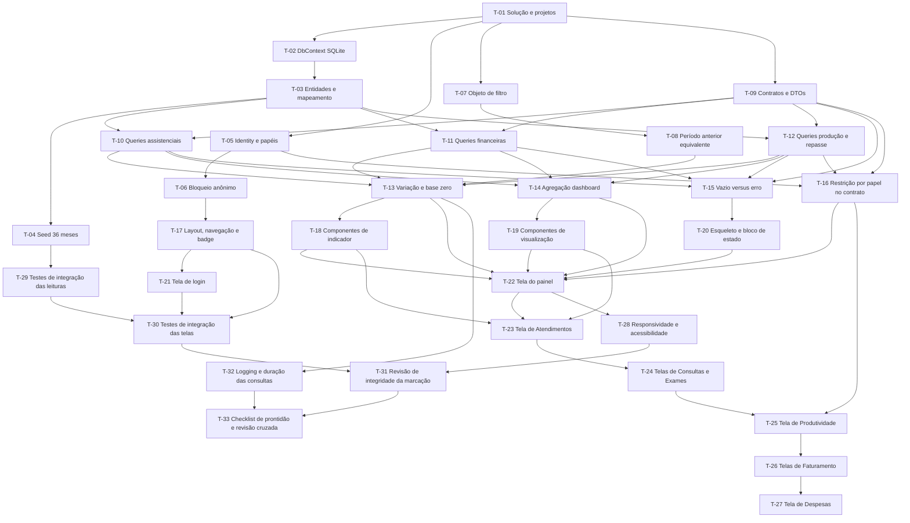

# Plano de Execução: Painel de Indicadores de Saúde — MVP com dados demonstrativos

**PRD de referência:** `docs/prds/PRD-001-painel-indicadores-saude.md`
**Arquitetura de referência:** `docs/architecture/proposta-arquitetural.md`
**SPEC-UI de referência:** `docs/prototype/SPEC-UI-001-painel-indicadores-saude.md`
**Cliente/Produto:** Projeto de laboratório (autoral) — Etapa 1, dados demonstrativos
**Stack:** .NET 10, ASP.NET Core Razor Pages, EF Core 10 + SQLite, Bootstrap 5, Chart.js local, xUnit
**Autor:** Anderson (via skill `planner-leanwork`)
**Data:** 2026-09-26
**Status:** Rascunho

---

## 1. Resumo executivo

Implementar um painel de leitura de sete indicadores de um serviço de saúde, alimentado por uma fonte
demonstrativa local em SQLite e sem nenhuma integração com o banco real da instituição. A quebra é **horizontal por
camada técnica** — Fundação, Contratos e lógica de leitura, Comparação e estados, Interface, Qualidade — porque a
entrega é uma Etapa 1 autocontida, sem dependência externa e sem necessidade de demonstrabilidade parcial: nada
dentro de um indicador é útil antes do seed existir, e nada no seed é útil antes das telas existirem. Cada tarefa
é uma fatia pequena (1 commit) com critério de aceite verificável, e o plano fecha a matriz
`ADR → RN → CA → UI → T → teste`, com `Telas:` preenchido em todas as tarefas de interface a partir da SPEC-UI.

## 2. Estratégia de entrega

**Modelo de entrega:** incremental por fase, sem feature flag e sem dark launch. Não há bandeira porque não há
produção: a Etapa 1 roda no notebook do autor, sobre arquivo local, e o único "deploy" é abrir a aplicação. Cada
fase é um estado coerente do sistema — dá para parar ao fim de qualquer fase sem deixar nada quebrado.

**Critério geral de "pronto":** os 26 cenários de aceite com interface verificáveis estão verdes, o badge de origem
demonstrativa aparece em toda tela com indicador, a suíte de testes passa, e um humano navigou do login às nove
telas em cada estado previsto na SPEC-UI. `CA-02` é o único cenário sem verificação manual de interface: ele é
verificado por teste de integração sobre o seed.

**Ordem não negociável:** o seed (T-04) vem antes de qualquer query, e o objeto de filtro (T-07) vem antes de
qualquer tela. A reversal de um card com valor errado é sempre resultado de filtro ou de query, nunca de tela.

## 3. Premissas e decisões

> ⚠️ **Premissa:** o SDK .NET 10 e o EF Core 10 estão disponíveis na máquina de desenvolvimento.
> ⚠️ **Premissa:** SQLite roda em arquivo local; os testes de integração usam arquivo temporário por teste, não
> provedor `InMemory` — o `InMemory` não traduz LINQ para SQL e esconderia justamente o problema que este projeto
> precisa enfrentar.
> ⚠️ **Premissa:** Chart.js é versionado localmente no repositório, sem CDN e sem etapa de build de frontend.
> ⚠️ **Premissa:** a data de referência de todo fato é a coluna `DataReferencia` do seed, porque `RN-10` é
> `[PENDENTE]` e a data de referência real ainda não foi descoberta. Se `RN-10` for respondida na Etapa 2, o nome da
> coluna é o ponto de troca.
> ⚠️ **Premissa:** as lacunas 4 a 9 e 11 a 12 da SPEC-UI estão aceitas como fora de escopo da Etapa 1. As lacunas 3 e
> 10 foram decididas com o responsável pelo produto e estão registradas nas decisões abaixo.
> ⚠️ **Premissa:** os valores de cor do wireframe são Direction C proposta, não identidade visual do cliente.

**Decisões técnicas relevantes já tomadas:**

- **Decisão:** solução única em quatro projetos — `PainelIndicadores.Web`, `PainelIndicadores.Application`,
  `PainelIndicadores.Infrastructure` e `PainelIndicadores.Tests` — sem projeto de domínio, porque a lógica de regra
  ainda não existe para morar em um. Promover o que tiver natureza de domínio é trabalho da Etapa 2 —
  *referência: ADR-001, D-01*
- **Decisão:** a fronteira entre o que a tela pode ver e o que existe é o contrato de leitura, não a view. As
  consultas são traduzidas para SQL e executadas no banco, nunca em memória — *referência: ADR-002, ADR-004*
- **Decisão:** a fonte demonstrativa é um arquivo SQLite criado por script de seed versionado, e a aplicação é
  somente leitura sobre ele — *referência: ADR-003, ADR-004*
- **Decisão:** autenticação por cookie do ASP.NET Core Identity com dois papéis, `Gestor` e `Administrador` —
  *referência: ADR-005*
- **Decisão:** gráficos com Chart.js local alimentado por ilhas `` no conteúdo quebra a
  página. Usar serialização com escape de `<` resolve.
- A versão do Chart.js fica fixada no repositório; atualizá-la é tarefa própria, não improviso no meio da sprint.

---

#### T-20 — Implementar esqueleto de carregamento e bloco de estado

- **Status:** Pendente
- **Complexidade:** Baixa
- **Depende de:** T-15
- **Implementa:** RN-12
- **Valida:** CA-07
- **Decisões base:** —
- **Telas:** UI-02 (carregando, vazio, erro), UI-03 a UI-08 (vazioFiltro), UI-09 (carregando, vazio, erro)
- **Camadas/arquivos afetados:**
  - `src/PainelIndicadores/PainelIndicadores.Web/Shared/Componentes/BlocoEstado.cshtml` *(novo)*
  - `src/PainelIndicadores/PainelIndicadores.Web/Shared/Componentes/Esqueleto.cshtml` *(novo)*

**Descrição:** implementar o componente que cobre os quatro estados não feliz: vazio, vazio por filtro, erro e
sem permissão, mais o esqueleto de carregamento. Cada estado declara a ação de recuperação — "Tentar novamente"
para erro, "Limpar filtros" para vazio por filtro, retorno ao período padrão para vazio. `.vazio` e `.erro` são
distintos e obrigatórios em toda tela que busca dado: erro nunca aparece como zero.

**Critério de aceite (testável):**
- [ ] `CA-07` verde: período sem dado exibe `0` no card e o bloco de vazio com ação de retorno
- [ ] Período com dado e filtro sem resultado exibe o total do período no texto do bloco
- [ ] Falha de consulta exibe o bloco de erro com "Tentar novamente" e não o bloco de vazio
- [ ] A tela de despesa não tem estado de vazio por filtro, porque não tem filtro além do período

**Testes a escrever:**
- *Integration:* `Periodo_vazio_exibe_zero_e_botao_de_retorno` (CA-07)
- *Integration:* `Filtro_sem_resultado_exibe_o_total_do_periodo_no_texto`
- *Integration:* `Erro_de_consulta_nao_exibe_o_bloco_de_vazio`

**Riscos / pontos de atenção:**
- Um mesmo componente com muitas variantes condicionais fica difícil de manter; a variante entra por parâmetro
  explícito, não por detecção de conteúdo.

---

#### T-21 — Implementar a tela de login

- **Status:** Pendente
- **Complexidade:** Baixa
- **Depende de:** T-17
- **Implementa:** RN-17
- **Valida:** CA-10
- **Decisões base:** ADR-005
- **Telas:** UI-01 (default, validacao, enviando, erroEnvio)
- **Camadas/arquivos afetados:**
  - `src/PainelIndicadores/PainelIndicadores.Web/Areas/Identity/Pages/Account/Login.cshtml` *(editado)*

**Descrição:** ajustar a tela de login do Identity aos quatro estados da SPEC-UI, com os quatro campos de rótulo
associado. Não há link de criar conta nem de recuperar senha, porque não existem essas rotas. A mensagem de
credencial inválida não revela se o e-mail existe.

**Critério de aceite (testável):**
- [ ] `CA-10` verde: sem autenticação, nenhuma tela de indicador é acessível
- [ ] Credencial inválida exibe "E-mail ou senha inválidos" e preserva os valores digitados
- [ ] Falha do serviço de autenticação exibe estado de erro com "Tentar novamente", distinto de credencial inválida
- [ ] Durante o envio, os campos e o botão ficam desabilitados

**Testes a escrever:**
- *Integration:* `Login_invalido_exibe_mensagem_sem_revelar_se_o_email_existe`
- *Integration:* `Login_valido_redireciona_para_a_url_de_origem` (CA-10)

**Riscos / pontos de atenção:**
- Os quatro estados são da SPEC-UI, mas três deles não são estado de página do Identity: precisam ser modelados
  com `ModelState` e uma marca de falha de serviço, não com JavaScript de front.

---

#### T-22 — Implementar a tela do painel com os sete indicadores

- **Status:** Pendente
- **Complexidade:** Média
- **Depende de:** T-13, T-14, T-16, T-17, T-18, T-19, T-20
- **Implementa:** RN-01, RN-14, RN-15, RN-30
- **Valida:** CA-03, CA-26, CA-27
- **Decisões base:** ADR-006
- **Telas:** UI-02 (default)
- **Camadas/arquivos afetados:**
  - `src/PainelIndicadores/PainelIndicadores.Web/Pages/Index.cshtml` *(novo)*
  - `src/PainelIndicadores/PainelIndicadores.Web/Pages/Index.cshtml.cs` *(novo)*

**Descrição:** montar o painel com os sete cards, o gráfico de linha de atendimentos, o donut de participação por
convênio e a tabela de resumo. Cada card carrega o link para a tela do seu indicador. O card de produtividade médica
repete a marcação de métrica provisória, porque a tela que explica a métrica é a outra. Nenhum conteúdo da tela é
restrito por papel — dado individual e repasse não aparecem aqui.

**Critério de aceite (testável):**
- [ ] `CA-26` verde: o painel exibe cards, gráficos e tabelas dos sete indicadores
- [ ] `CA-03` verde: o card de produtividade médica declara que a métrica é provisória e não é produtividade
- [ ] Cada card navega para a tela do seu indicador
- [ ] Nenhum dado individual de profissional nem valor de repasse aparece no painel
- [ ] A tela não tem estado de acesso restrito, porque nenhum de seus elementos é restrito

**Testes a escrever:**
- *Integration:* `Painel_exibe_os_sete_indicadores_com_valor_e_variacao` (CA-26)
- *Integration:* `Card_de_produtividade_declara_metrica_provisoria` (CA-03)
- *Integration:* `Cada_card_aponta_para_a_tela_do_seu_indicador`

**Riscos / pontos de atenção:**
- Os sete cards precisam vir de uma única leitura normalizada; sete leituras independentes podem discordar sobre o
  período e produzir um painel que não fecha.

---

#### T-23 — Implementar a tela de Atendimentos

- **Status:** Pendente
- **Complexidade:** Média
- **Depende de:** T-18, T-19, T-20, T-22
- **Implementa:** RN-20, RN-21, RN-22, RN-23
- **Valida:** CA-13, CA-14
- **Decisões base:** —
- **Telas:** UI-03 (default)
- **Camadas/arquivos afetados:**
  - `src/PainelIndicadores/PainelIndicadores.Web/Pages/Indicadores/Atendimentos.cshtml` *(novo)*
  - `src/PainelIndicadores/PainelIndicadores.Web/Pages/Indicadores/Atendimentos.cshtml.cs` *(novo)*

**Descrição:** montar a tela de Atendimentos com as quatro dimensões — tipo, sexo, convênio e médico —, o seletor de
agrupamento pelas mesmas quatro dimensões, o card de total com contador de filtros ativos, o donut por sexo e a
tabela agrupada com linha de total. Os avisos de pendência de `RN-22` e `RN-23` aparecem na tela, porque o que não se
sabe sobre o dado precisa ser visível para quem lê o número.

**Critério de aceite (testável):**
- [ ] `CA-13` verde: o total de atendimentos do período é exibido com variação
- [ ] `CA-14` verde: os recortes por tipo, sexo, convênio e médico funcionam e a seleção é cumulativa
- [ ] O seletor de agrupamento oferece as mesmas quatro dimensões dos filtros
- [ ] A linha de total da tabela coincide com o card
- [ ] A tela exibe os avisos de pendência de `RN-22` e `RN-23`

**Testes a escrever:**
- *Integration:* `Total_de_atendimentos_igual_a_soma_das_linhas_do_agrupamento` (CA-13)
- *Integration:* `Cada_dimensao_filtrando_altera_o_total_para_o_valor_esperado` (CA-14)
- *Integration:* `Filtros_aplicados_em_conjuncao_restringem_junto` (CA-14)

**Riscos / pontos de atenção:**
- A tela é a primeira a exercitar quatro dimensões simultâneas; se o agrupamento e o filtro compartilharem
  predicado por engano, o total e a tabela divergem e o bug aparece como "número errado" sem indicação de onde.

---

#### T-24 — Implementar as telas de Consultas e Exames

- **Status:** Pendente
- **Complexidade:** Média
- **Depende de:** T-18, T-19, T-20, T-23
- **Implementa:** RN-24, RN-25, RN-26, RN-27, RN-28, RN-29
- **Valida:** CA-15, CA-16, CA-17
- **Decisões base:** —
- **Telas:** UI-04 (default), UI-05 (default)
- **Camadas/arquivos afetados:**
  - `src/PainelIndicadores/PainelIndicadores.Web/Pages/Indicadores/Consultas.cshtml` *(novo)*
  - `src/PainelIndicadores/PainelIndicadores.Web/Pages/Indicadores/Consultas.cshtml.cs` *(novo)*
  - `src/PainelIndicadores/PainelIndicadores.Web/Pages/Indicadores/Exames.cshtml` *(novo)*
  - `src/PainelIndicadores/PainelIndicadores.Web/Pages/Indicadores/Exames.cshtml.cs` *(novo)*

**Descrição:** as duas telas são estruturalmente iguais e diferem na fonte da consulta e no texto dos avisos, então
compartilham a partial de estrutura em vez de duplicar a página. A diferença de requisito está em `RN-25`: Consultas
não oferece a dimensão de tipo, porque o tipo já é fixo no indicador, e a tela exibe um selo dizendo isso. Exames
aceita sexo, convênio e médico, com o rótulo neutro **"Médico"** — sem qualificador de função — e a tela declara
visivelmente que a atribuição semântica (solicitante, executor, responsável ou outra) é `[PENDENTE]` para a Etapa 2,
conforme a decisão 3 da SPEC-UI. O filtro da Etapa 1 agrupa pelo atributo `medico` do conjunto demonstrativo, por
coincidência de nomenclatura com a palavra de `RN-28`; `medicoSolicitante` fica sem uso, reservado para quando a
semântica for descoberta. `RN-28` **não** foi alterada para atribuir função ao médico — inventá-la violaria `RN-04`.

**Critério de aceite (testável):**
- [ ] `CA-15` verde: o total de consultas do período é exibido com variação
- [ ] `CA-16` verde: a tela de consultas não oferece recorte por tipo de atendimento
- [ ] `CA-17` verde: o total de exames do período é exibido com variação
- [ ] A tela de exames oferece sexo, convênio e médico
- [ ] A tela de consultas exibe o selo de tipo fixo
- [ ] O rótulo do filtro de médico é "Médico", sem qualificador de solicitante, executor ou responsável
- [ ] A tela de exames declara que a atribuição semântica do médico é `[PENDENTE]` para a Etapa 2

**Testes a escrever:**
- *Integration:* `Total_de_consultas_igual_a_soma_das_linhas_do_agrupamento` (CA-15)
- *Integration:* `Tela_de_consultas_nao_oferece_a_dimensao_tipo` (CA-16)
- *Integration:* `Total_de_exames_igual_a_soma_das_linhas_do_agrupamento` (CA-17)
- *Integration:* `Filtro_de_medico_em_exames_usa_rotulo_neutro_e_declara_atribuicao_pendente` — verifica o rótulo
  renderizado e a presença da declaração de pendência na página

**Riscos / pontos de atenção:**
- Reaproveitar a partial entre as duas telas é tentador e correto, mas a partial não pode receber o filtro de tipo
  como opcional — se receber, a dimensão reaparece por acidente em Consultas e quebra `CA-16`.
- O rótulo neutro pode ser lido pelo gestor como afirmação de que a atribuição já foi definida. A declaração
  explícita de pendência na tela existe para impedir essa leitura; se alguém remover a nota para simplificar a
  tela, a tela volta a mentir e este critério de aceite falha.

---

#### T-25 — Implementar a tela de Produtividade médica

- **Status:** Pendente
- **Complexidade:** Alta
- **Depende de:** T-16, T-24
- **Implementa:** RN-18, RN-30, RN-31, RN-32, RN-33, RN-35
- **Valida:** CA-11, CA-12, CA-18, CA-19, CA-20
- **Decisões base:** ADR-005
- **Telas:** UI-06 (default, semPermissao)
- **Camadas/arquivos afetados:**
  - `src/PainelIndicadores/PainelIndicadores.Web/Pages/Indicadores/Produtividade.cshtml` *(novo)*
  - `src/PainelIndicadores/PainelIndicadores.Web/Pages/Indicadores/Produtividade.cshtml.cs` *(novo)*

**Descrição:** montar a tela com o aviso de métrica provisória antes de qualquer número, os filtros de período e
médico, o gráfico de linha do Top 6 por volume, o gráfico de barras de distribuição, a tabela mensal por
profissional e a tabela de repasse condicional ao papel. O Top 6 é a decisão registrada: 23 séries no mesmo eixo
ficam ilegíveis, e o filtro de médico é o seletor que isola a série de um profissional. A restrição de repasse é do
elemento, não da tela — o Gestor continua vendo a produção agregada.

**Critério de aceite (testável):**
- [ ] `CA-18` verde: a tela declara que a métrica é provisória e não é produtividade
- [ ] `CA-19` verde: a evolução mensal da métrica é exibida, e o Top 6 vem ordenado por volume
- [ ] `CA-20` verde: o valor de repasse é exibido para o `Administrador` e para nenhum outro papel
- [ ] `CA-11` verde: para o `Gestor`, a seção de repasse é substituída por acesso restrito, sem nenhum valor
- [ ] `CA-12` verde: o `Administrador` recebe dado individual de profissional
- [ ] O aviso de métrica provisória aparece antes de qualquer número, inclusive no estado de carregamento

**Testes a escrever:**
- *Integration:* `Tela_declare_a_metrica_provisoria_antes_dos_numeros` (CA-18)
- *Integration:* `Evolucao_mensal_e_exibida_com_o_Top_6_ordenado_por_volume` (CA-19)
- *Integration:* `Repasse_visivel_para_administrador_e_ausente_para_gestor` (CA-20, CA-11, CA-12)
- *Integration:* `Gestor_continua_vendo_a_producao_agregada`

**Riscos / pontos de atenção:**
- O aviso de métrica provisória é o requisito mais fácil de quebrar por conveniência: se alguém mover o aviso para
  baixo da tabela para "arrumar o layout", `CA-18` falha e a tela volta a apresentar número provisório como
  produtividade.
- A produção agregada por profissional e a série mensal precisam reconciliar com o card; são leituras diferentes e a
  divergência aparece como número que não fecha.

---

#### T-26 — Implementar as telas de Faturamento por convênios e Faturamento particular

- **Status:** Pendente
- **Complexidade:** Média
- **Depende de:** T-18, T-19, T-20, T-25
- **Implementa:** RN-37, RN-38, RN-39, RN-40, RN-41, RN-42, RN-43, RN-44
- **Valida:** CA-21, CA-22, CA-23
- **Decisões base:** —
- **Telas:** UI-07 (default), UI-08 (default)
- **Camadas/arquivos afetados:**
  - `src/PainelIndicadores/PainelIndicadores.Web/Pages/Indicadores/FaturamentoConvenios.cshtml` *(novo)*
  - `src/PainelIndicadores/PainelIndicadores.Web/Pages/Indicadores/FaturamentoConvenios.cshtml.cs` *(novo)*
  - `src/PainelIndicadores/PainelIndicadores.Web/Pages/Indicadores/FaturamentoParticular.cshtml` *(novo)*
  - `src/PainelIndicadores/PainelIndicadores.Web/Pages/Indicadores/FaturamentoParticular.cshtml.cs` *(novo)*

**Descrição:** a tela de convênios traz o total, as barras por convênio, o donut de participação e a tabela com
coluna de participação, e aceita filtro de convênio e tipo — sem sexo e sem médico, porque essas dimensões não têm
significado no faturamento. A tela de particular traz o total e a composição contra convênios, e aceita tipo e
médico. No estado de período sem dado, a participação percentual não é exibida, porque dividir por total zero não
tem resposta.

**Critério de aceite (testável):**
- [ ] `CA-21` verde: o faturamento é agrupado por convênio no período
- [ ] `CA-22` verde: a participação percentual de cada convênio é exibida e soma 100%
- [ ] `CA-23` verde: o faturamento particular é exibido separado do faturamento por convênios
- [ ] Período sem dado não exibe participação percentual
- [ ] Nenhuma das duas telas oferece recorte por sexo

**Testes a escrever:**
- *Integration:* `Faturamento_agrupado_por_convenio_soma_o_total` (CA-21)
- *Integration:* `Participacao_por_convenio_soma_100_por_cento` (CA-22)
- *Integration:* `Faturamento_particular_nao_se_soma_ao_de_convenios` (CA-23)

**Riscos / pontos de atenção:**
- A participação percentual de cada convênio é o mesmo número em três lugares — donut, coluna da tabela e rótulo
  do card. Se cada um arredondar de um jeito, "não fecha".

---

#### T-27 — Implementar a tela de Despesas

- **Status:** Pendente
- **Complexidade:** Baixa
- **Depende de:** T-18, T-19, T-20, T-26
- **Implementa:** RN-45, RN-46
- **Valida:** CA-24, CA-25
- **Decisões base:** —
- **Telas:** UI-09 (default)
- **Camadas/arquivos afetados:**
  - `src/PainelIndicadores/PainelIndicadores.Web/Pages/Indicadores/Despesas.cshtml` *(novo)*
  - `src/PainelIndicadores/PainelIndicadores.Web/Pages/Indicadores/Despesas.cshtml.cs` *(novo)*

**Descrição:** montar a tela mais simples do conjunto: período como única dimensão, card de total, média mensal, mês
mais alto e a linha de evolução. A tela declara em texto que não oferece recorte por sexo, paciente nem médico, e
que a composição por categoria fica para a Etapa 2 por decisão registrada — `RN-47` é `[PENDENTE]` e `RN-46` já
condiciona a categoria a "quando a categoria existir". Não há estado de vazio por filtro, porque não existe filtro
além do período.

**Critério de aceite (testável):**
- [ ] `CA-24` verde: as despesas do período são exibidas com variação
- [ ] `CA-25` verde: a tela não oferece recorte por sexo, por paciente nem por médico
- [ ] A tela declara que a categoria de despesa não está disponível e por quê
- [ ] Não existe filtro de categoria nem estado de vazio por filtro nesta tela

**Testes a escrever:**
- *Integration:* `Despesas_do_periodo_sao_exibidas_com_variacao` (CA-24)
- *Integration:* `Tela_de_despesas_nao_oferece_sexo_paciente_nem_medico` (CA-25)
- *Integration:* `Tela_de_despesas_nao_oferece_filtro_de_categoria`

**Riscos / pontos de atenção:**
- A Entity `Despesa` tem coluna de categoria porque `RN-46` a prevê; a tela não oferecê-lo é decisão, e não deve ser
  "corrigido" depois por alguém que leia o schema e ache a coluna órfã.

---

#### T-28 — Implementar responsividade e a operabilidade básica por teclado

- **Status:** Pendente
- **Complexidade:** Média
- **Depende de:** T-22
- **Implementa:** —
- **Valida:** CA-27
- **Decisões base:** —
- **Telas:** UI-01 a UI-09 (todos os estados)
- **Camadas/arquivos afetados:**
  - `src/PainelIndicadores/PainelIndicadores.Web/wwwroot/css/painel.css` *(editado)*

**Descrição:** fazer a grade de cards e gráficos reorganizar em coluna única abaixo de 900 px, e atender o requisito de
operabilidade básica adotado na decisão 4 da SPEC-UI: rótulo associado a todo campo de formulário e toda tarefa concluível
por teclado, com foco visível. O Bootstrap 5 já entrega rótulo e navegação por teclado na maior parte dos casos, então o
trabalho aqui é **não remover** o que a biblioteca oferece ao escrever markup e CSS customizados, e não adicionar
mecanismo. Contraste medido e conformidade formal com WCAG 2.1/2.2 AA **não** são critério desta tarefa: dependem de
auditoria e de decisão institucional, e a direção visual do wireframe ainda é proposta, não identidade do cliente.

**Critério de aceite (testável):**
- [ ] `CA-27` verde: as nove telas são utilizáveis em largura de desktop e em largura estreita, sem rolagem
  horizontal nem conteúdo sobreposto
- [ ] Todo campo de formulário tem rótulo associado
- [ ] Todo elemento interativo é alcançável por teclado e tem foco visível

**Testes a escrever:**
- *Manual:* percorrer as nove telas em largura estreita e em desktop, conferindo layout, foco e ordem de tabulação
- *Integration:* `Todo_campo_de_formulario_tem_rotulo_associado` — verificação automatizada sobre o HTML
- *Integration:* `Todo_elemento_interativo_e_alcancavel_por_teclado` — verificação automatizada sobre a ordem de
  tabulação e a ausência de `tabindex` positivo indevido

**Riscos / pontos de atenção:**
- A grade de cards em coluna única empurra a linha do gráfico para fora da dobra; a altura dos cards precisa ser
  limitada para o cartão não dominating a tela inteira no mobile.
- Estilo customizado em `painel.css` pode remover o anel de foco do Bootstrap por aesthetic. Como não há medição de
  contraste na Etapa 1, o foco visível é o único sinal perceptível de posição para quem usa teclado — não remover
  `outline` sem substituto equivalente.

---

### Fase 5 — Qualidade, validação e integridade

**Objetivo da fase:** provar o comportamento por teste automatizado e conferir que nada do conjunto se apresenta
como regra real.

**Critério de conclusão da fase:** suíte verde, com os 26 cenários de interface cobertos por teste ou por ponto de
validação manual registrado, e o checklist de prontidão inteiro verificado.

---

#### T-29 — Escrever os testes de integração dos contratos de leitura

- **Status:** Pendente
- **Complexidade:** Média
- **Depende de:** T-04
- **Implementa:** —
- **Valida:** CA-02, CA-06, CA-07, CA-08, CA-13, CA-14, CA-15, CA-16, CA-17, CA-19, CA-21, CA-22, CA-23, CA-24
- **Decisões base:** ADR-002 *(preferir a costura mais alta que já existe — o contrato de leitura)*
- **Camadas/arquivos afetados:**
  - `tests/PainelIndicadores/PainelIndicadores.Tests/Integracao/Contratos/*.cs` *(novos)*

**Descrição:** montar a base de teste de integração: um `WebApplicationFactory` com banco SQLite em arquivo
temporário por teste, seed aplicado uma vez e contrato de leitura como costura de teste. A base é o que torna as
tarefas seguintes triviais, então ela vem antes delas. SQLite em arquivo temporário, nunca `InMemory` — o provedor
em memória não traduz LINQ para SQL e um teste verde nele não prova que a consulta roda no banco real.

**Critério de aceite (testável):**
- [ ] A base monta um banco com seed aplicado e o mesmo conjunto em todos os testes
- [ ] Os testes de contrato rodam contra a consulta real, não contra dublê
- [ ] Nenhum teste usa provedor `InMemory`
- [ ] O seed é aplicado uma vez por execução de teste, e o custo é aceitável

**Testes a escrever:**
- *Integration:* `Contrato_de_indicador_sobre_o_seed_produz_o_total_do_periodo`
- *Integration:* `Total_do_agrupamento_igual_ao_card` — a invariante de T-14

**Riscos / pontos de atenção:**
- Sem banco compartilhado entre testes, cada um paga o seed; com 30 testes isso vira minutos. A base precisa
  reaproveitar o arquivo do seed entre testes de leitura, que não escrevem nada.

---

#### T-30 — Escrever os testes de integração das telas e do acesso por papel

- **Status:** Pendente
- **Complexidade:** Média
- **Depende de:** T-17, T-21, T-29
- **Implementa:** —
- **Valida:** CA-01, CA-04, CA-05, CA-07, CA-10, CA-11, CA-12, CA-18, CA-20, CA-26
- **Decisões base:** ADR-005
- **Camadas/arquivos afetados:**
  - `tests/PainelIndicadores/PainelIndicadores.Tests/Integracao/Telas/*.cs` *(novos)*

**Descrição:** testar as telas pelo comportamento observável: a requisição responde, o conteúdo esperado está no
HTML, e o conteúdo proibido não está. O teste de badge varre as nove telas autenticado, porque é o único cenário
que depende de layout compartilhado. O teste de papel compara o HTML dos dois papéis, e não apenas o status, porque
o vazamento que importa é o valor na marcação gerada.

**Critério de aceite (testável):**
- [ ] `CA-01` verde: as nove telas com indicador contêm o texto de origem demonstrativa
- [ ] `CA-10` verde: as nove telas redirecionam usuário anônimo para o login
- [ ] `CA-11` e `CA-12` verdes: o HTML do Gestor não contém nenhum valor de repasse, e o do Administrador contém
- [ ] A tela de produção médica renderiza os dois papéis a partir do mesmo caminho de código
- [ ] `GET /css/painel.css` e `GET /js/graficos.js` respondem `200` — guarda de regressão de `R-03`, cujo dono é T-17

**Testes a escrever:**
- *Integration:* `Nove_telas_exibem_o_badge_de_origem_demonstrativa` (CA-01)
- *Integration:* `Telas_de_indicador_redirecionam_usuario_anonimo` (CA-10)
- *Integration:* `Html_do_gestor_nao_contem_valor_de_repasse` (CA-11)
- *Integration:* `Html_do_administrador_contem_valor_de_repasse` (CA-12)
- *Integration:* `Assets_estaticos_sao_servidos` — faz `GET` de `/css/painel.css` e `/js/graficos.js` e exige
  `200` com `content-type` de CSS/JavaScript. Cobre `R-03` do review de T-01: é o teste que impede a remoção de
  `app.MapStaticAssets();` de passar despercebida, porque nenhum critério de T-17 ou T-19 depende de o arquivo
  estar sendo de fato servido

**Riscos / pontos de atenção:**
- O teste de badge por varredura é o que impede a regressão silenciosa: o badge é requisito e a forma mais comum de
  perdê-lo é mexer no layout sem rodar o teste.

---

#### T-31 — Revisar a integridade da marcação e a ausência de regra apresentada como real

- **Status:** Pendente
- **Complexidade:** Média
- **Depende de:** T-28, T-30
- **Implementa:** RN-01, RN-02, RN-03, RN-04, RN-05, RN-36
- **Valida:** CA-01, CA-03
- **Decisões base:** ADR-003, ADR-004
- **Camadas/arquivos afetados:**
  - `docs/README.md` *(novo)*

**Descrição:** conferir, tela por tela, que nenhum número demonstrativo aparece sem marcação e que nenhum texto
apresenta cálculo demonstrativo como regra do serviço de saúde. Esta tarefa existe porque `RN-03` proíbe a promoção
silenciosa: um cálculo que funciona e tem nome bonito é exatamente o que vai ser copiado para a Etapa 2 como se fosse
regra. O README do projeto registra a origem do conjunto, a lista de regras `[DEMO]`, `[PENDENTE]` e `[VALIDAR]`, e
o caminho para o PRD.

**Critério de aceite (testável):**
- [ ] `CA-01` e `CA-03` verdes: nenhuma tela exibe indicador sem a marcação de origem demonstrativa
- [ ] Nenhum texto de interface apresenta cálculo demonstrativo como regra definitiva do serviço de saúde
- [ ] O README declara a origem demonstrativa do conjunto e lista as regras pendentes
- [ ] Toda regra marcada `[PENDENTE]` aparece registrada como pendência, e nenhuma foi preenchida por suposição
- [ ] Nenhuma métrica demonstrativa foi promovida a nome de negócio definitivo: `RN-05` e `RN-36` continuam em aberto,
  porque `RN-36` só se cumpre após validação numérica contra o dado real, que é Etapa 2

**Testes a escrever:**
- *Integration:* reaproveitar o teste de badge com uma lista explícita de rotas a auditar
- *Manual:* leitura do texto de cada uma das nove telas contra a seção 8 do PRD

**Riscos / pontos de atenção:**
- A tela de produtividade médica é o caso de maior risco: o nome "Produtividade médica" é o nome de negócio real, e
  o número é uma contagem. Sem a marcação de métrica provisória, a tela afirma uma regra que `RN-33` diz não existir.

---

#### T-32 — Implementar logging estruturado e instrumentação de duração das consultas

- **Status:** Pendente
- **Complexidade:** Média
- **Depende de:** T-13
- **Implementa:** —
- **Valida:** —
- **Decisões base:** ADR-007 *(sem cache; instrumentar duração)*
- **Camadas/arquivos afetados:**
  - `src/PainelIndicadores/PainelIndicadores.Infrastructure/Persistencia/InterceptorDuracaoConsulta.cs` *(novo)*
  - `src/PainelIndicadores/PainelIndicadores.Web/Program.cs` *(editado)*

**Descrição:** registrar o tempo de cada consulta e o erro de cada falha, em log estruturado, com o indicador e o
período como contexto. Como `ADR-007` opta por não usar cache, a duração da consulta é a única evidência de que o
modelo de leitura sob demanda aguenta. O log de acesso é separado do log técnico: `RN-19` é `[PENDENTE]` e não existe
exigência de auditoria de acesso, então não se inventa um.

**Critério de aceite (testável):**
- [ ] Cada consulta executada emite uma entrada de log com duração, indicador e período
- [ ] Falha de consulta emite log de erro com a exceção e o contexto do filtro
- [ ] Nenhum log contém dado individual de profissional nem valor de repasse
- [ ] Nenhum log de auditoria de acesso é produzido

**Testes a escrever:**
- *Integration:* `Consulta_emite_log_com_duracao_e_contexto`
- *Integration:* `Falha_de_consulta_emite_log_de_erro`

**Riscos / pontos de atenção:**
- O interceptor de duração registra a consulta por padrão do EF Core; capturar o SQL completo em log pode despejar
  dado no arquivo de log. Manter o SQL fora, ou registrado só em nível de depuração.

---

#### T-33 — Executar o checklist de prontidão e a revisão cruzada dos artefatos

- **Status:** Pendente
- **Complexidade:** Média
- **Depende de:** T-31, T-32
- **Implementa:** RN-01, RN-02
- **Valida:** CA-01, CA-02, CA-26, CA-27
- **Decisões base:** —
- **Camadas/arquivos afetados:**
  - `docs/plans/PLAN-001-painel-indicadores-saude.md` *(editado)*

**Descrição:** percorrer o checklist de prontidão inteiro e conferir a matriz de rastreabilidade
`ADR → RN → CA → UI → T → teste`: toda regra do PRD tem pelo menos uma tarefa, todo cenário com interface tem um
ponto de verificação, e toda tela da SPEC-UI tem tarefa. A conferência é o que fecha a última inconsistência entre os
artefatos, que só aparece quando os cinco existem.

**Critério de aceite (testável):**
- [ ] Toda regra do PRD aparece em pelo menos um campo `Implementa:` de tarefa, ou em "Questões em aberto" quando é
  gate de transição para a Etapa 2 — `RN-05`, `RN-16`, `RN-34` e `RN-36` são desse segundo tipo, por definição
- [ ] Todo cenário com interface aparece em pelo menos um campo `Valida:` ou em um ponto de validação manual
- [ ] Toda tela da SPEC-UI aparece em pelo menos um campo `Telas:`
- [ ] O checklist de prontidão está inteiro verificado
- [ ] O histórico de execução registra as tarefas concluídas com o respective commit

**Testes a escrever:**
- *Não aplicável* — tarefa de conferência documental, não de código.

**Riscos / pontos de atenção:**
- Requisito do PRD sem tarefa é o modo mais silencioso desterilizar a entrega: o código compila, os testes passam, e
  a regra simplesmente não existe. A conferência precisa ser feita contra o PRD, não contra a memória do que foi
  implementado.

## 6. Testes transversais

- [ ] **Smoke end-to-end:** autenticar como `Gestor`, percorrer as sete telas de indicador, confirmar o acesso
  restrito na de produtividade, sair, autenticar como `Administrador`, confirmar o repasse visível
- [ ] **Varredura de estados:** percorrer os 42 estados da SPEC-UI e confirmar que cada um produz a resposta descrita
  na seção 4 da SPEC-UI
- [ ] **Regressão de reconciliação:** o total do painel, a soma das linhas de cada tabela e o card do indicador
  continuam coincidindo para todo filtro
- [ ] **Regressão de marcação:** as nove telas continuam exibindo o texto de origem demonstrativa
- [ ] **Teste de volume:** o seed produz um conjunto na ordem de dezenas de milhares de registros e a tela do painel
  responde com o mesmo orçamento de tempo ao aplicá-lo — é o que valida `RN-06`
- [ ] **Regressão de vazio versus erro:** período sem dado exibe `0`, e falha de fonte exibe erro, nas nove telas

## 7. Checklist de prontidão para produção

O termo "produção" aqui é Etapa 1: não há deploy de produção, há aplicação local. Os itens que dependem de
ambiente compartilhado foram adaptados em vez de marcados como não aplicáveis.

- [ ] Os 27 critérios de aceite do PRD verificados — 26 por teste ou inspeção, `CA-02` por teste de integração
- [ ] Cobertura de testes conforme o padrão adotado, com os contratos de leitura cobertos por teste de integração
- [ ] Code review aprovado por pelo menos 1 par
- [ ] Seed executado e inspecionado: 36 meses, dezenas de milhares de registros, variedade de dimensões
- [ ] Logging estruturado nos pontos críticos, sem dado individual nem valor de repasse no log
- [ ] Nenhuma regra `[PENDENTE]` preenchida por suposição durante a implementação
- [ ] Badge de origem demonstrativa presente nas nove telas com indicador
- [ ] README e documentação interna atualizados, com a lista de regras `[DEMO]`, `[PENDENTE]` e `[VALIDAR]`
- [ ] Validação manual das nove telas por humano, em cada estado previsto na SPEC-UI
- [ ] Matriz `ADR → RN → CA → UI → T → teste` conferida sem lacuna
- [ ] Rollback documentado — neste caso, apagar o arquivo SQLite e reexecutar o seed

## 8. Rollback e contingência

- **Escopo real:** a Etapa 1 não toca o banco da instituição, não grava dado de negócio e não tem ambiente
  compartilhado. Não há migração a reverter nem dado real em risco — `ADR-004` é o que torna isso verdade.
- **Fonte demonstrativa:** o arquivo SQLite é forward-only e reconstruível. O rollback é apagar o arquivo e
  reexecutar o seed, que é determinístico pela semente fixa, então o conjunto volta exatamente ao mesmo estado.
- **Usuários do Identity:** o seed recria os dois usuários de demonstração. Apagar o banco de autenticação apaga
  também os registros técnicos de login, o que é aceitável porque não são dado de negócio.
- **Código:** cada tarefa é uma mudança isolada, então o rollback é reverter o commit correspondente. Não há
  refactor de alto impacto previsto — não há nome de coluna nem tipo compartilhado que este plano renomeie.
- **Se uma regra `[PENDENTE]` for respondida no meio da execução:** o ajuste é na tarefa que implementa a regra
  correspondente, e não nas telas. A matriz de rastreabilidade existe para localizar essa tarefa sem varrer o
  código.

## 9. Pontos de validação humana

- [ ] Após **T-04** (seed gerado) — revisar volume e variedade antes de seguir. Todo o plano depende de o seed
  produzir um conjunto que exercite filtro, agrupamento, comparação e série histórica
- [ ] Após **T-05** (Identity e papéis) — confirmar os dois papéis e as credenciais de demonstração antes de
  construir tela que dependa deles
- [ ] Após **Fase 2** (contratos e consultas prontos) — revisar com o PO os números que os contratos devolvem
  contra o conjunto seedado, antes de expor em tela
- [ ] Antes de **T-27** (tela de Despesas) — confirmar que a remoção do card "Resultado do período" e a ausência
  de filtro de categoria estão aceitas
- [ ] Antes de **T-28** (operabilidade básica) — a decisão 4 da SPEC-UI já está registrada: rótulo associado e tarefa
  concluível por teclado são o requisito do MVP, sem contraste medido e sem certificação formal
- [ ] Após **Fase 4** (telas prontas) — comparar as nove telas implementadas com o wireframe, estado a estado
- [ ] Antes de **T-33** (fechamento) — nenhum cálculo demonstrativo pode ter sido promovido a regra do serviço de
  saúde durante a implementação

## 10. Questões em aberto

- [ ] A data de referência real de cada fato — *responsável: negócio da instituição* — *sem impacto na Etapa 1,
  bloqueia a Etapa 2 inteira* (`RN-10`)
- [ ] O que conta como atendimento, e com que status um registro é excluído — *responsável: negócio* — *bloqueia a
  validação numérica de `RN-20` na Etapa 2* (`RN-22`)
- [ ] A definição real de consulta e de exame — *responsável: negócio* — *bloqueia a validação de `RN-24` e `RN-27`*
  (`RN-26`, `RN-29`)
- [ ] O critério real de produtividade médica e a regra de repasse — *responsável: negócio e financeiro* — *bloqueia
  a substituição da métrica provisória* (`RN-33`, `RN-35`)
- [ ] A composição da produção médica — o que entra na métrica e com que peso — *responsável: negócio* — *bloqueia a
  validação de `RN-30` contra o dado real* (`RN-34`)
- [ ] O significado gerencial de comparar períodos: queda contra período anterior, ou sazonalidade contra o ano
  anterior — *responsável: negócio* — *bloqueia a validação de `RN-13` a `RN-15` como regra do serviço de saúde*
  (`RN-16`)
- [ ] As categorias de despesa e a possibilidade de rateio — *responsável: financeiro* — *bloqueia a categoria na
  tela de Despesas* (`RN-47`)
- [ ] A atribuição semântica do "Médico" no indicador de Exames — solicitante, executor, responsável ou outra função —
  *responsável: negócio* — *não bloqueia a Etapa 1: a tela entrega rótulo neutro e declara a pendência*; bloqueia a
  substituição do filtro demonstrativo pelo dado real (decisão 3 da SPEC-UI, `T-24`)
- [ ] A política institucional real de acesso e a exigência de auditoria — *responsável: governança* — *bloqueia o
  refinamento da restrição por papel* (`RN-19`)
- [ ] Se a instituição exigir conformidade formal com WCAG 2.1/2.2 AA, e não apenas operabilidade básica —
  *responsável: cliente* — *fora do escopo da Etapa 1*; exige auditoria e decisão institucional, e a direção visual
  ainda é proposta (decisão 4 da SPEC-UI, `T-28`)
- [ ] Confirmação da remoção do card "Resultado do período" — *responsável: cliente* — *bloqueia `T-27`*
  (lacuna 12 da SPEC-UI)

## 11. Histórico de execução

| Tarefa | Status | Concluída em | Commit | Observação |
|--------|--------|--------------|--------|------------|
| T-01 | Concluído | 2026-09-26 | — | Build 0 erros / 0 avisos; `dotnet test` exit 0 com zero testes. Desvios autorizados: `Program.cs` criado (necessário ao build) e 4 `.csproj` movidos para subpasta própria. **Review round 1:** `docs/reviews/REVIEW-T-01-2026-09-26.md` — ⚠️ Aprovado com ressalvas, **6 findings**: R-01/R-02/R-03 **resolvidos** (critério 3 reescrito, nota do desvio nº 3 corrigida, `MapStaticAssets()` atribuída a T-17), R-04/R-06/R-07 **abertos**. Detalhes em T-01. |
| T-02 | Pendente | — | — | — |
| T-03 | Pendente | — | — | — |
| T-04 | Pendente | — | — | — |
| T-05 | Pendente | — | — | — |
| T-06 | Pendente | — | — | — |
| T-07 | Pendente | — | — | — |
| T-08 | Pendente | — | — | — |
| T-09 | Pendente | — | — | — |
| T-10 | Pendente | — | — | — |
| T-11 | Pendente | — | — | — |
| T-12 | Pendente | — | — | — |
| T-13 | Pendente | — | — | — |
| T-14 | Pendente | — | — | — |
| T-15 | Pendente | — | — | — |
| T-16 | Pendente | — | — | — |
| T-17 | Pendente | — | — | — |
| T-18 | Pendente | — | — | — |
| T-19 | Pendente | — | — | — |
| T-20 | Pendente | — | — | — |
| T-21 | Pendente | — | — | — |
| T-22 | Pendente | — | — | — |
| T-23 | Pendente | — | — | — |
| T-24 | Pendente | — | — | — |
| T-25 | Pendente | — | — | — |
| T-26 | Pendente | — | — | — |
| T-27 | Pendente | — | — | — |
| T-28 | Pendente | — | — | — |
| T-29 | Pendente | — | — | — |
| T-30 | Pendente | — | — | — |
| T-31 | Pendente | — | — | — |
| T-32 | Pendente | — | — | — |
| T-33 | Pendente | — | — | — |
