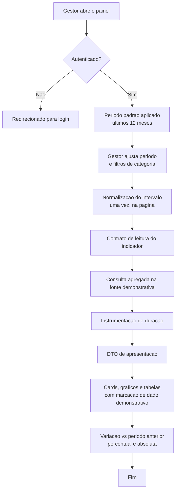
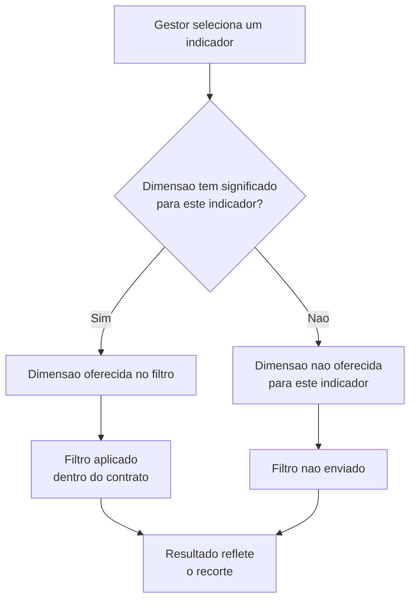
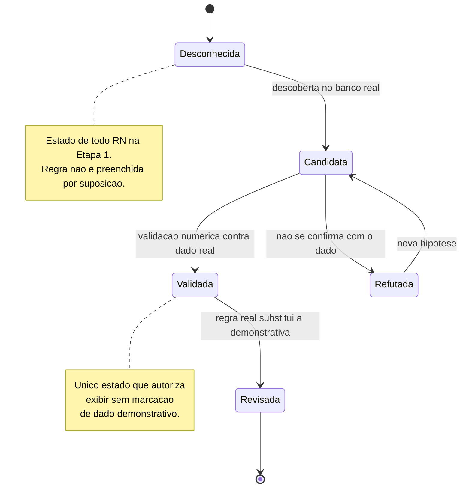
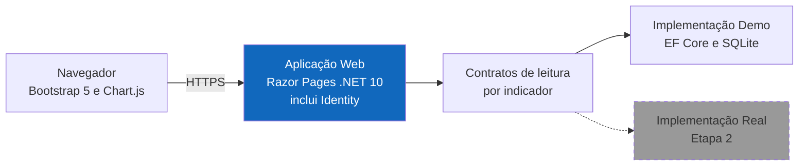

# PRD: Painel de Indicadores de Saúde — MVP com dados demonstrativos

**Cliente/Produto:** Projeto de laboratório (autoral) — Painel de Indicadores de Saúde
**Tipo:** Epic
**Autor:** Anderson (via skill `prd-leanwork`)
**Data:** 2026-09-26
**Status:** Aprovado

> **Proposta arquitetural de referência:** `docs/architecture/proposta-arquitetural.md` (versão 0.1)
>
> **Escopo deste PRD:** a **Etapa 1** do projeto — a aplicação web funcional operando sobre uma fonte de dados demonstrativa em SQLite. A **Etapa 2** (integração com o banco real da instituição) **não** é entregue por este PRD e tem suas próprias pendências, registradas aqui como pendências de descoberta a resolver.

---

## Notação de status das regras de negócio

Toda regra `RN-XX` deste documento carrega uma marca de status. **A marca é parte do contrato do documento** e será lida pelo plano de execução e pelo review.

| Marca | Significado | Consequência prática |
|---|---|---|
| `[DEMO]` | Regra **demonstrativa** da Etapa 1. Criada exclusivamente para permitir desenvolvimento e validação da aplicação sobre a fonte SQLite. | **Não é regra de negócio do serviço de saúde.** Não pode ser usada como referência de cálculo |
| `[PENDENTE]` | A regra de negócio real **existe, mas é desconhecida**. Registrada como pendência de descoberta. | **Não preenchida por suposição.** Nenhuma hipótese foi convertida em regra |
| `[VALIDAR]` | A regra só pode ser declarada válida **após** descoberta **e** validação numérica contra o banco real ou fonte confiável. | Suspensa até a Etapa 2 |

Regras de negócio reais que não foram descobertas **não foram inventadas** neste documento. Onde há ausência de conhecimento, há `[PENDENTE]` com o questionamento explícito — não uma estimativa.

**Regra de ouro deste PRD:** nenhuma implementação da Etapa 1 pode ser promovida a regra de negócio sem passar por `RN-05`.

---

## 1. Visão geral

Uma aplicação web que mostra, em gráficos e cards, sete indicadores gerenciais de um serviço de saúde: **atendimentos, consultas, exames, produtividade médica, faturamento por convênios, faturamento particular e despesas**. O gestor escolhe um período e seleciona filtros de categoria, e vê os valores, a evolução no tempo e a comparação com o período anterior.

Esta entrega é a **Etapa 1** de duas. A Etapa 1 existe porque **o banco de dados real ainda não foi acessado e ninguém sabe como cada indicador é calculado**. Em vez de esperar, o projeto constrói a aplicação completa sobre uma **fonte de dados demonstrativa** — dados fictícios, gerados por script versionado, com regras de cálculo simplificadas e declaradas como simplificadas. Isso permite validar a aplicação, os gráficos, os filtros e a navegação enquanto a descoberta do banco real não acontece. Quando o acesso existir, a fonte demonstrativa é trocada por uma segunda implementação **sem alterar a interface** (ADR-002).

A distinção entre o que é real e o que é demonstração é explícita na interface: toda tela que exibe indicador mostra a marcação **"Dados demonstrativos — regras reais pendentes de validação"**.

## 2. Problema e contexto

**Problema:** os dados existem no sistema de gestão da instituição, mas não estão disponíveis de forma consolidada. Obter cada número exige consulta ou relatório separado, o que torna cara e lenta a leitura da operação como um todo. Pior: **não existe especificação consolidada de como cada indicador é calculado**. As regras estão dispersas em relatórios, consultas ad hoc e no conhecimento de quem opera o sistema.

**Contexto atual:** hoje o gestor depende de consultas separadas ou relatórios separados para acompanhar volume de atendimento, produção médica, desempenho de convênios, faturamento e despesas. Cada uma dessas respostas custa uma consulta própria, e nenhuma delas dá a visão consolidada.

**Impacto de não fazer:** a gestão continua decidindo com informação parcial e fragmentada, sem visão de tendência, concentração ou variação. E o projeto segue sem mecanismo para transformar conhecimento tácito em regra verificável — o que bloqueia não só o dashboard, mas qualquer sistema futuro sobre esses dados.

## 3. Objetivo

Permitir que gestores de um serviço de saúde acompanhem os sete indicadores gerenciais em um dashboard responsivo, com filtro de período, filtros de categoria e comparação entre períodos, sobre fonte demonstrativa — deixando a aplicação pronta para trocar de fonte de dados sem reescrita de interface quando o acesso ao banco real for concedido.

### Métricas de sucesso

- Os 7 indicadores são exibidos e filtráveis sobre a fonte demonstrativa, com recorte por período e por categoria.
- Nenhuma tela exibe indicador sem a marcação de dado demonstrativo visível (RN-02).
- Toda regra de negócio real não descoberta está registrada como pendência no documento, sem hipótese disfarçada de regra.
- A troca da fonte demonstrativa por uma fonte real não exige alteração em código de interface (critério verificável na Etapa 2).

## 4. Escopo

### 4.1. Dentro do escopo

- Sete indicadores: Atendimentos, Consultas, Exames, Produtividade médica, Faturamento por convênios, Faturamento particular, Despesas.
- Filtro de período com início e fim explícitos, e período padrão.
- Filtros de categoria aplicados conforme o significado de cada indicador (ver 8.4).
- Comparação com período anterior equivalente, com variação percentual e absoluta.
- Comparação com mesmo período do ano anterior, como opção adicional.
- Visualizações: cards de indicador, gráficos de coluna, de linha e de pizza/donut, tabelas auxiliares de detalhamento (ADR-006).
- Autenticação por cookie e autorização por dois papéis: `Gestor` e `Administrador` (ADR-005).
- Acesso somente leitura à fonte de dados; nenhuma escrita (ADR-004).
- Marcação persistente de origem demonstrativa em todas as telas com indicador (RN-02).
- Conjunto de dados demonstrativo: 36 meses, granularidade diária, dezenas de milhares de registros.
- Registro das pendências de descoberta de cada indicador.

### 4.2. Fora do escopo

- **Integração com o banco real da instituição** — Etapa 2, com PRD próprio, porque depende de acesso externo e de descoberta que não existem hoje.
- Escrever, alterar ou excluir dados em qualquer banco (restrição dura do cliente, ADR-004).
- Substituir o sistema de gestão clínico-financeiro, ou executar qualquer operação transacional.
- Prontuário eletrônico, prescrição, agendamento, faturamento transacional, emissão de documento fiscal.
- Exibir dado clínico identificável de paciente. Os indicadores são agregados.
- Processamento em tempo real de segundos; atualização sob demanda.
- Aplicativo mobile nativo, funcionamento offline.
- Cache, pré-agregação e processamento incremental — decisão ADR-007, adiada até haver medição real (P-07).
- Hospedagem de produção (IIS, Windows Service, Linux, Docker) — premissa P-10, sem ambiente definido.
- Granularidade fina de perfis de acesso e políticas institucionais de auditoria — não existem (seção 15).

## 5. Personas e usuários impactados

| Persona | Papel | Como interage com a feature |
|---|---|---|
| Gestor administrativo | `Gestor` | Acompanha volume de atendimento, consultas, exames, produção por tipo, internação e Productivity por médico. Usa filtro de período e por tipo de atendimento, sexo e convênio |
| Gestor financeiro | `Gestor` | Acompanha faturamento por convênio, faturamento particular, participação de cada convênio e despesas. Usa filtro de período e por convênio |
| Responsável pela operação | `Gestor` | Acompanha produtividade individual, exames prescritos e cirurgias por médico, quando essas dimensões estiverem disponíveis |
| Administrador do painel | `Administrador` | Acesso adicional aos dados individuais de profissionais e aos valores de repasse, restritos aos demais papéis |

**Nota de escopo:** a distinção de perfis acima é o **mínimo** que a restrição de acesso exige, não um modelo de permissão maduro. A política institucional real de acesso e auditoria **não existe** e está registrada como pendência em RN-19.

## 6. Hierarquia de entrega

- **Epic:** Painel de Indicadores de Saúde — MVP com dados demonstrativos
  - **Feature 1: Autenticação e acesso**
    - **PBI 1.1** — Autenticação por cookie com dois papéis (`Gestor`, `Administrador`)
    - **PBI 1.2** — Restrição de dados individuais de profissionais e valores de repasse ao papel `Administrador`
  - **Feature 2: Filtro de período, categorias e comparação**
    - **PBI 2.1** — Filtro de período com início e fim explícitos e período padrão
    - **PBI 2.2** — Filtros de categoria aplicados conforme o significado de cada indicador
    - **PBI 2.3** — Comparação com período anterior equivalente e com mesmo período do ano anterior
  - **Feature 3: Conjunto de dados demonstrativo e integridade**
    - **PBI 3.1** — Seed versionado com 36 meses de histórico diário e variedade de dimensões
    - **PBI 3.2** — Marcação persistente de origem demonstrativa em todas as telas com indicador
  - **Feature 4: Indicadores de volume assistencial**
    - **PBI 4.1** — Atendimentos com recortes por tipo, sexo, convênio e médico
    - **PBI 4.2** — Consultas com recortes por sexo, convênio e médico
    - **PBI 4.3** — Exames com recortes por sexo, convênio e médico
  - **Feature 5: Indicadores de produção médica**
    - **PBI 5.1** — Produtividade médica com a métrica demonstrativa e sua marcação
    - **PBI 5.2** — Dados individuais de profissional e valores de repasse sob restrição de acesso
  - **Feature 6: Indicadores financeiros**
    - **PBI 6.1** — Faturamento por convênios e participação percentual de cada convênio
    - **PBI 6.2** — Faturamento particular
    - **PBI 6.3** — Despesas do serviço de saúde
  - **Feature 7: Visualizações**
    - **PBI 7.1** — Cards de indicador e gráficos de coluna, linha e pizza/donut
    - **PBI 7.2** — Tabelas auxiliares de detalhamento

> Esta é uma sugestão de quebra. O Product Owner pode reorganizar conforme prioridade.
>
> **PBI não é `T-XX`.** O PBI é unidade de backlog e costuma valer vários dias; a tarefa do plano de execução tem teto de 4 horas (`templates/id-conventions.md`). Um PBI vira várias `T-XX` quando o `planner-leanwork` decompõe.

## 7. Fluxos

### 7.1. Fluxo principal — consulta de indicador com filtro de período



**Descrição passo a passo.** O gestor se autentica. O painel aplica o período padrão. Ele ajusta o intervalo de datas e, opcionalmente, filtros de categoria. A página normaliza o intervalo uma única vez, para que todos os indicadores da tela interpretem o mesmo período. Cada indicador é obtido por seu contrato de leitura, que consulta a fonte demonstrativa. A duração de cada consulta é registrada. A página renderiza cards, gráficos e tabelas auxiliares, sempre com a marcação de dado demonstrativo, e exibe a comparação com o período anterior.

### 7.2. Fluxos alternativos / de erro

**Período sem dados.** O filtro é válido, mas nenhum registro corresponde. Todos os indicadores exibem `0`, e a comparação exibe `—` em vez de variação percentual, porque não há base de cálculo. A tela não exibe estado de erro. (RN-12, RN-14)

**Filtro de categoria incompatível com o indicador.** Uma dimensão sem significado para o indicador **não é oferecida** naquele indicador. A aplicação não aceita um filtro que o indicador não reconhece, em vez de ignorá-lo silenciosamente.



**Usuário sem permissão para dado restrito.** Um usuário com papel `Gestor` que acesse uma visualização de dados individuais de profissionais ou de valores de repasse recebe indicação de acesso restrito, e nenhum valor é exibido. (RN-18)

**Regra real ainda não descoberta.** A aplicação não tenta adivinhar. Onde a regra real é `[PENDENTE]`, a Etapa 1 exibe a métrica demonstrativa com a marcação de dado demonstrativo, e o documento mantém a pendência. Não há caminho de código que "melhore" a aproximação sem que a descoberta aconteça. (RN-03, RN-04)

**Falha de fonte de dados.** Se a fonte demonstrativa não estiver disponível, a tela exibe estado de falha com orientação, e nenhum indicador é exibido parcialmente. Registra-se a falha no log estruturado. Nenhum valor é inventado para preencher a lacuna.

## 8. Regras de negócio

### 8.1. Integridade do conjunto demonstrativo

- **RN-01:** `[DEMO]` Todo dado exibido na Etapa 1 é fictício, produzido por script de seed versionado, e não representa dado real de instituição de saúde. (ADR-003)
- **RN-02:** `[DEMO]` Toda tela que exiba indicador apresenta de forma visível e persistente a marcação **"Dados demonstrativos — regras reais pendentes de validação"**. (mitigação do risco R-04 e dívida D-04 da proposta arquitetural)
- **RN-03:** `[DEMO]` Nenhum cálculo da Etapa 1 pode ser reutilizado como regra de negócio do serviço de saúde sem antes passar por RN-05.
- **RN-04:** `[PENDENTE]` Toda regra de negócio real não descoberta é registrada como pendência com o questionamento explícito, e **não é preenchida por suposição**.
- **RN-05:** `[VALIDAR]` Uma regra de negócio real só é considerada válida após ser descoberta **e** validada numericamente contra o banco real ou fonte confiável.
- **RN-06:** `[DEMO]` O conjunto demonstrativo cobre 36 meses de histórico com granularidade diária, dezenas de milhares de registros, com variedade de tipo de atendimento, sexo, convênio e médico suficiente para exercitar filtro, agrupamento, comparação e visualização histórica.

### 8.2. Período, filtro de categoria e comparação

- **RN-07:** `[DEMO]` Todo indicador é calculado para um período com data de início e data de fim explicitamente informadas.
- **RN-08:** `[DEMO]` Na ausência de filtro informado, o período padrão é os 12 meses encerrados na data corrente.
- **RN-09:** `[DEMO]` O período é aplicado como intervalo semiaberto `[data inicial, data final]`, sobre a data de referência do registro.
- **RN-10:** `[PENDENTE]` **Qual é a data de referência real** de cada fato — data do atendimento, data de lançamento, data de confirmação ou data de competência. A escolha altera todos os totais quando há divergência entre elas.
- **RN-11:** `[DEMO]` Filtros de categoria aplicáveis ao indicador são cumulativos: múltiplos filtros aplicados simultaneamente restringem o resultado por conjunção.
- **RN-12:** `[DEMO]` Período ou recorte sem registros exibe `0` no indicador, e não estado vazio nem estado de erro.
- **RN-13:** `[DEMO]` O período anterior equivalente tem o mesmo número de dias do período selecionado e encerra no dia anterior ao seu início.
- **RN-14:** `[DEMO]` A comparação exibe variação percentual e variação absoluta em relação ao período de referência selecionado.
- **RN-15:** `[DEMO]` A comparação com o mesmo período do ano anterior é oferecida como opção adicional à comparação padrão, e não a substitui.
- **RN-16:** `[PENDENTE]` **O significado gerencial de "comparar períodos"** para o serviço de saúde — se o gestor compara com o período anterior para detectar queda, ou com o ano anterior para detectar sazonalidade. Nenhuma das leituras foi assumida como regra.

> **Nota de status (D2, ajustada pelo cliente):** RN-13 a RN-15 são **comportamento de dashboard decidido nesta entrega**, não regra de negócio definitiva do serviço de saúde. Estão marcadas `[DEMO]` por isso. O significado gerencial da comparação permanece `[PENDENTE]` em RN-16.

### 8.3. Autenticação e acesso

- **RN-17:** `[DEMO]` O acesso a qualquer indicador exige usuário autenticado. (ADR-005)
- **RN-18:** `[DEMO]` Dados individuais de profissionais e valores de repasse são exibidos somente ao papel `Administrador`; o papel `Gestor` recebe indicação de acesso restrito e nenhum valor. (ADR-005)
- **RN-19:** `[PENDENTE]` **A política institucional real de acesso e auditoria não existe.** Não se sabe quem pode ver o quê, nem se há exigência de registro de acesso. Nenhuma foi inventada.

### 8.4. Indicador — Atendimentos

- **RN-20:** `[DEMO]` O total de atendimentos do período é a contagem de registros de atendimento cuja data de referência está no período, sem qualquer exclusão por status.
- **RN-21:** `[DEMO]` O indicador aceita recorte por **tipo de atendimento** (consulta, exame, procedimento, internação clínica, internação cirúrgica), por **sexo** do paciente, por **convênio** e por **médico**.
- **RN-22:** `[PENDENTE]` **O que conta como atendimento** — quais eventos entram, qual status exclui um registro (cancelado, estornado, não comparecimento) e se atendimento sem médico asignado é contado.
- **RN-23:** `[PENDENTE]` **Disponibilidade real das dimensões** — se o banco registra tipo, sexo, convênio e médico em todos os atendimentos, e com que nível de preenchimento.

### 8.5. Indicador — Consultas

- **RN-24:** `[DEMO]` O total de consultas do período é a contagem de atendimentos cujo tipo de atendimento é consulta.
- **RN-25:** `[DEMO]` O indicador aceita recorte por **sexo** do paciente, por **convênio** e por **médico**. Não oferece recorte por tipo de atendimento, porque o tipo já é fixo neste indicador.
- **RN-26:** `[PENDENTE]` **A definição de consulta** — se todo tipo "consulta" do sistema de gestão é consulta, se há distinção entre consulta médica e não médica, e se primeira consulta e retorno são tratados igual.

### 8.6. Indicador — Exames

- **RN-27:** `[DEMO]` O total de exames do período é a contagem de registros de exame cuja data de referência está no período.
- **RN-28:** `[DEMO]` O indicador aceita recorte por **sexo** do paciente, por **convênio** e por **médico**.
- **RN-29:** `[PENDENTE]` **O que conta como exame** — se a contagem é de exame solicitado, de exame realizado, ou de ambos; se exame solicitado e não realizado conta; e como os exames são agrupados para exibição.

### 8.7. Indicador — Produtividade médica

- **RN-30:** `[DEMO]` A métrica exibida sob o nome "Produtividade médica" é, na Etapa 1, a **contagem de atendimentos por médico no período**. É uma métrica provisória, exibida com o nome de negócio e com a marcação de RN-02, e **não** é produtividade.
- **RN-31:** `[DEMO]` O indicador oferece recorte por **médico** e por **período**, e exibe a evolução da métrica ao longo do tempo.
- **RN-32:** `[DEMO]` O valor de repasse atribuído a cada profissional é exibido como informação separada, sob restrição de acesso ao papel `Administrador`. (RN-18)
- **RN-33:** `[PENDENTE]` **O critério real de produtividade médica** — se pondera por tipo de atendimento, se conta por consulta ou por procedimento, se compara com meta, e em que intervalo. **Este é o indicador com maior lacuna de conhecimento.**
- **RN-34:** `[PENDENTE]` **A composição da produção médica** — se exames prescritos por médico e cirurgias realizadas por médico entram ou não na métrica, e com que peso.
- **RN-35:** `[PENDENTE]` **A regra de repasse** — como o valor de repasse é apurado, a qual fato ele se refere e em que competência.
- **RN-36:** `[VALIDAR]` A métrica de produtividade e a de repasse só podem ser exibidas com o nome de negócio definitivo após validação numérica contra o dado real. (RN-05)

### 8.8. Indicador — Faturamento por convênios

- **RN-37:** `[DEMO]` O faturamento por convênio do período é a soma dos valores de atendimento faturado no período, agrupada por convênio.
- **RN-38:** `[DEMO]` A participação percentual de um convênio é o faturamento desse convênio dividido pelo faturamento total do mesmo período e filtro, expresso em porcentagem.
- **RN-39:** `[DEMO]` O indicador aceita recorte por **convênio** e, quando fizer sentido para a análise financeira, por **tipo de atendimento**.
- **RN-40:** `[PENDENTE]` **O que é "faturamento"** — valor faturado, valor autorizado, valor glosado ou valor recebido; e qual competência: data do atendimento, data de faturamento ou data de recebimento.
- **RN-41:** `[PENDENTE]` **O tratamento de glosa, recusa e estorno** — se valores glosados ou estornados são excluídos, compensados ou exibidos separadamente.

### 8.9. Indicador — Faturamento particular

- **RN-42:** `[DEMO]` O faturamento particular do período é a soma dos valores de atendimento particular no período, agrupada sob a categoria "Particular".
- **RN-43:** `[DEMO]` O indicador aceita recorte por **tipo de atendimento** e por **médico**, e exibe a evolução ao longo do tempo.
- **RN-44:** `[PENDENTE]` **Como o particular é representado no banco** — se por convênio nulo, por convênio de código próprio, ou por marcação em outro campo. Nenhuma representação foi presumida.

### 8.10. Indicador — Despesas

- **RN-45:** `[DEMO]` As despesas do serviço de saúde no período são a soma dos valores de despesa cuja data de referência está no período.
- **RN-46:** `[DEMO]` O indicador aceita apenas as dimensões com significado para análise financeira — **período** e **categoria de despesa**, quando a categoria existir. Não oferece recorte por sexo, por paciente, nem por médico atendente.
- **RN-47:** `[PENDENTE]` **As categorias de despesa** existentes e se há rateio de despesa por centro de custo, por convênio ou por unidade.

### 8.11. Mapa indicador × dimensão

Cada dimensão está associada a um indicador **apenas quando possui significado de negócio**. Dimensão sem significado não é oferecida, e sua ausência não é silenciosa: consta como `[PENDENTE]` na seção do indicador.

| Indicador | Período | Tipo atend. | Sexo | Convênio | Médico | Categoria despesa |
|---|:-:|:-:|:-:|:-:|:-:|:-:|
| Atendimentos | ✔ | ✔ | ✔ | ✔ | ✔ | — |
| Consultas | ✔ | fixo | ✔ | ✔ | ✔ | — |
| Exames | ✔ | fixo | ✔ | ✔ | ✔ | — |
| Produtividade médica | ✔ | — | — | — | ✔ | — |
| Faturamento por convênios | ✔ | ✔ | — | ✔ | — | — |
| Faturamento particular | ✔ | ✔ | — | ✔ | ✔ | — |
| Despesas | ✔ | — | — | — | — | ✔ |

**Dimensões deliberadamente não associadas:** sexo não se aplica a faturamento nem a despesas, por não ter significado na análise financeira; médico não se aplica ao faturamento por convênio, porque a Production médica por médico é indicador próprio (Feature 5) e sobrepõe a leitura financeira; tipo de atendimento não se aplica a produtividade, cuja composição real é pendente (RN-34).

**Dimensões candidatas cuja disponibilidade real é pendente:** exames prescritos por médico, cirurgias realizadas por médico, e valor de repasse. Todas dependem de RN-33 a RN-35 e de confirmação no banco real. Nenhuma é oferecida na Etapa 1 como se sua regra fosse conhecida.

## 9. Critérios de aceite

### Funcionalidade: Integridade do conjunto demonstrativo

```gherkin
  Cenário [CA-01]: Tela de indicador exibe marcação de dado demonstrativo
    Dado que estou autenticado com o papel "Gestor"
    E o conjunto demonstrativo está carregado
    Quando visualizo qualquer tela que exiba indicadores
    Então a marcação "Dados demonstrativos — regras reais pendentes de validação" está visível
    E a marcação está presente sem que eu precise abrir um menu ou um aviso
    E o conjunto exibido provém do script de seed versionado (RN-01, RN-02)

  Cenário [CA-02]: Conjunto demonstrativo cobre o período histórico esperado
    Dado que o script de seed foi executado
    Quando inspeciono o conjunto demonstrativo
    Então ele cobre 36 meses de histórico com datas de granularidade diária
    E o volume total é de dezenas de milhares de registros
    E existem variação de tipo de atendimento, sexo, convênio e médico
    E existem, para cada mês, dados suficientes para comparação de períodos (RN-06)

  Cenário [CA-03]: Regra de negócio real não descoberta não é apresentada como definitiva
    Dado que o indicador "Produtividade médica" possui métrica demonstrativa
    E a regra real de produtividade está pendente de descoberta
    Quando visualizo o indicador
    Então a métrica exibida está acompanhada da marcação de dado demonstrativo
    E a aplicação não apresenta a métrica como se fosse a regra real
    E nenhum valor foi preenchido por suposição no lugar da regra pendente (RN-03, RN-04)
```

### Funcionalidade: Período, filtro e comparação

```gherkin
  Cenário [CA-04]: Período padrão aplicado na ausência de filtro
    Dado que estou autenticado e não informei período
    Quando visualizo o painel
    Então o período aplicado é de 12 meses encerrados na data corrente
    E o período aplicado está visível no filtro (RN-08)

  Cenário [CA-05]: Filtro de período explícito restringe todos os indicadores da tela
    Dado que estou autenticado
    E informo o período de 2025-01-01 a 2025-06-30
    Quando visualizo o painel
    Então todos os indicadores da tela refletem apenas esse intervalo
    E registros fora do intervalo não são exibidos
    E o intervalo é tratado como semiaberto, incluindo o dia inicial e o dia final (RN-07, RN-09)

  Cenário [CA-06]: Filtros de categoria são cumulativos
    Dado que estou autenticado
    E o indicador "Atendimentos" aceita recorte por tipo de atendimento, sexo e convênio
    Quando aplico o filtro de tipo "exame" e o filtro de convênio "Unimed"
    Então o resultado corresponde a atendimentos que são simultaneamente exame e convênio Unimed
    E a combinação de filtros restringe por conjunção, não soma resultados (RN-11)

  Cenário [CA-07]: Período sem dados exibe zero, não erro
    Dado que estou autenticado
    E informo um período sem nenhum registro correspondente
    Quando visualizo o painel
    Então cada indicador exibe o valor zero
    E a tela não exibe estado de erro
    E a comparação de variação percentual exibe um traço, e não um número (RN-12, RN-14)

  Cenário [CA-08]: Comparação com o período anterior equivalente
    Dado que estou autenticado
    E o período selecionado tem 30 dias
    E o período anterior de referência tem os 30 dias imediatamente anteriores
    Quando visualizo a comparação
    Então a variação percentual em relação ao período anterior é exibida
    E a variação absoluta em relação ao período anterior é exibida (RN-13, RN-14)

  Cenário [CA-09]: Comparação com o mesmo período do ano anterior é adicional
    Dado que estou autenticado
    E visualizo a comparação padrão com o período anterior
    Quando ativo a comparação com o mesmo período do ano anterior
    Então a comparação com o ano anterior é exibida em adição à comparação padrão
    E a comparação padrão permanece disponível (RN-15)
```

### Funcionalidade: Autenticação e acesso

```gherkin
  Cenário [CA-10]: Usuário não autenticado não acessa indicadores
    Dado que não estou autenticado
    Quando tento acessar uma tela de indicador
    Então sou redirecionado para a autenticação
    E nenhum indicador é exibido
    E nenhuma consulta à fonte de dados é executada (RN-17)

  Cenário [CA-11]: Papel Gestor não acessa dado individual de profissional
    Dado que estou autenticado com o papel "Gestor"
    Quando acesso uma visualização de dado individual de profissional ou valor de repasse
    Então vejo indicação de que o acesso é restrito
    E nenhum valor individual é exibido (RN-18)

  Cenário [CA-12]: Papel Administrador acessa dado individual de profissional
    Dado que estou autenticado com o papel "Administrador"
    Quando acesso uma visualização de dado individual de profissional ou valor de repasse
    Então o valor é exibido
    E a tela mantém a marcação de dado demonstrativo, por se tratar de dado demonstrativo (RN-02, RN-18)
```

### Funcionalidade: Indicadores assistenciais

```gherkin
  Cenário [CA-13]: Total de atendimentos no período
    Dado que estou autenticado
    E existem 120 atendimentos com data de referência dentro do período selecionado
    E existem 35 atendimentos com data de referência fora do período
    Quando visualizo o indicador "Atendimentos"
    Então o total exibido é 120
    E os 35 atendimentos fora do período não são contabilizados (RN-20)

  Esquema do Cenário [CA-14]: Recortes de Atendimentos por dimensão com significado
    Dado que estou autenticado
    E o conjunto demonstrativo possui atendimentos distribuídos por <dimensão>
    Quando visualizo o indicador "Atendimentos" e aplico o recorte por <dimensão>
    Então o resultado é agrupado por <dimensão>
    E a soma dos grupos corresponde ao total de atendimentos do período sob os demais filtros (RN-21)

    Exemplos:
      | dimensão      |
      | tipo de atendimento |
      | sexo               |
      | convênio           |
      | médico             |

  Cenário [CA-15]: Total de consultas no período
    Dado que estou autenticado
    E existem 90 atendimentos do tipo "consulta" no período
    Quando visualizo o indicador "Consultas"
    Então o total exibido é 90
    E atendimentos de outros tipos não são contabilizados neste indicador (RN-24)

  Cenário [CA-16]: Dimensão sem significado não é oferecida no indicador
    Dado que estou autenticado
    E o indicador "Consultas" tem o tipo de atendimento fixo em "consulta"
    Quando observo os filtros disponíveis para o indicador "Consultas"
    Então não há filtro por tipo de atendimento, porque não tem significado neste indicador (RN-25)

  Cenário [CA-17]: Total de exames no período
    Dado que estou autenticado
    E existem 210 exames com data de referência dentro do período
    Quando visualizo o indicador "Exames"
    Então o total exibido é 210 (RN-27)
```

### Funcionalidade: Produtividade médica

```gherkin
  Cenário [CA-18]: Métrica demonstrativa de produtividade por médico
    Dado que estou autenticado
    E o critério real de produtividade está pendente de descoberta
    Quando visualizo o indicador "Produtividade médica"
    Então a métrica exibida é a contagem de atendimentos por médico no período
    E a métrica está acompanhada da marcação de dado demonstrativo
    E a aplicação não afirma que essa métrica é a regra real de produtividade (RN-30, RN-04)

  Cenário [CA-19]: Evolução da métrica de produtividade ao longo do tempo
    Dado que estou autenticado
    E o período selecionado abrange 12 meses
    Quando visualizo a evolução da métrica de produtividade
    Então a aplicação apresenta a métrica por mês para cada médico
    E a evolução respeita o filtro de período selecionado (RN-31)

  Cenário [CA-20]: Valor de repasse exibido sob restrição de acesso
    Dado que estou autenticado com o papel "Administrador"
    E existem valores de repasse atribuídos a profissionais no período
    Quando visualizo os valores de repasse
    Então os valores são exibidos por profissional
    E a tela mantém a marcação de dado demonstrativo (RN-32, RN-18)
```

### Funcionalidade: Indicadores financeiros

```gherkin
  Cenário [CA-21]: Faturamento agrupado por convênio
    Dado que estou autenticado
    E existem atendimentos faturados a três convênios no período
    Quando visualizo o indicador "Faturamento por convênios"
    Então o valor é agrupado por convênio
    E a soma dos grupos corresponde ao faturamento total do período (RN-37)

  Cenário [CA-22]: Participação percentual de convênio
    Dado que estou autenticado
    E o faturamento total do período é 100.000 para o filtro aplicado
    E o convênio "Unimed" faturou 30.000 no mesmo período e filtro
    Quando visualizo a participação do convênio "Unimed"
    Então a participação exibida é 30 por cento do total
    E a participação de todos os convênios soma 100 por cento (RN-38)

  Cenário [CA-23]: Faturamento particular separado dos convênios
    Dado que estou autenticado
    E existem atendimentos particular e atendimentos de convênio no período
    Quando visualizo o indicador "Faturamento particular"
    Então o total exibido corresponde apenas aos atendimentos particular
    E o indicador "Faturamento por convênios" não inclui o particular (RN-42)

  Cenário [CA-24]: Despesas do período
    Dado que estou autenticado
    E existem despesas somando 45.000 no período
    Quando visualizo o indicador "Despesas"
    Então o total exibido é 45.000
    E despesas fora do período não são contabilizadas (RN-45)

  Cenário [CA-25]: Dimensões sem significado não são oferecidas em Despesas
    Dado que estou autenticado
    Quando observo os filtros disponíveis para o indicador "Despesas"
    Então não há filtro por sexo, por paciente, nem por médico atendente
    E há filtro por período
    E o filtro por categoria de despesa é oferecido somente se a categoria existir na origem (RN-46, RN-47)
```

### Funcionalidade: Visualizações

```gherkin
  Cenário [CA-26]: Dashboard apresenta cards, gráficos e tabelas
    Dado que estou autenticado
    E o período está definido
    Quando visualizo o painel
    Então são apresentados cards de indicador com o valor do período
    E gráficos de coluna, de linha e de pizza ou donut conforme o indicador
    E tabelas auxiliares de detalhamento quando houver necessidade de detalhar um valor
    E todas as visualizações estão marcadas como demonstrativas (RN-02)

  Cenário [CA-27]: Dashboard é responsivo
    Dado que estou autenticado
    Quando visualizo o painel em tela estreita e em tela larga
    Então o conteúdo permanece legível e utilizável em ambas
    E os filtros e os cards permanecem acessíveis
```

**Cobertura e pendências de validação (RN-04, RN-05):** os cenários acima validam o comportamento da **Etapa 1 sobre dados demonstrativos**. Nenhum deles valida uma regra de negócio real do serviço de saúde. As regras `[PENDENTE]` listadas em RN-10, RN-16, RN-19, RN-22, RN-23, RN-26, RN-29, RN-33 a RN-35, RN-40, RN-41, RN-44 e RN-47 **não têm cenário de aceite neste PRD**, porque não há regra descoberta a validar. Elas produzirão cenários próprios na Etapa 2, após descoberta e validação numérica (RN-05).

## 10. Permissionamento

| Ação | Perfis autorizados | Observação |
|---|---|---|
| Autenticar-se na aplicação | `Gestor`, `Administrador` | Autenticação por cookie (ADR-005). Não há Active Directory (RN-17) |
| Visualizar indicadores agregados | `Gestor`, `Administrador` | Todos os sete indicadores |
| Filtrar por período e categoria | `Gestor`, `Administrador` | Dimensões limitadas ao que tem significado no indicador (RN-21, RN-25, RN-39, RN-43, RN-46) |
| Visualizar dado individual de profissional | `Administrador` | dado de profissional é dado pessoal (RN-18) |
| Visualizar valores de repasse | `Administrador` | Acesso restrito declarado pelo cliente (RN-18) |
| Gerenciar usuários e papéis | — | **Fora de escopo.** Não há tela de administração nesta entrega |

**Lacuna declarada:** a tabela acima é o mínimo necessário para atender à restrição de acesso. A política institucional real **não existe** e está registrada como pendência em RN-19. Não se afirma que esta tabela seja a política correta.

## 11. Integrações e dados

### 11.1. Sistemas envolvidos

- **Fonte demonstrativa (SQLite)** — banco em arquivo local, criado e populado por script de seed versionado. Substitui temporariamente o banco real. (ADR-003)
- **Banco da instituição** — **não existe integração nesta entrega.** É a Etapa 2. Nenhuma tabela, coluna, relacionamento ou código de classificação do banco real foi inventado neste documento.

### 11.2. Dados consumidos

Na Etapa 1, todos os dados vêm da fonte demonstrativa, e todos são fictícios (RN-01):

| Entidade demonstrativa | Atributos que suportam os indicadores | Usada por |
|---|---|---|
| Atendimento | Data de referência, tipo, sexo do paciente, convênio, médico, indicador de particular, valor faturado | Atendimentos, Consultas, Faturamento por convênios, Faturamento particular |
| Exame | Data de referência, sexo do paciente, convênio, médico, médico solicitante | Exames |
| Médico | Identificador, nome | Produtividade, todos os recortes por médico |
| Convênio | Identificador, nome | Faturamento por convênios, participação, Atendimentos |
| Despesa | Data de referência, categoria, valor | Despesas |
| Repasse | Data de referência, médico, valor | Repasse, sob restrição de acesso |

**Estrutura real a descobrir (Etapa 2):** o equivalente dessas entidades no banco da instituição, suas chaves, seus relacionamentos e seus códigos de classificação. Registrado como pendência, não preenchido.

### 11.3. Dados produzidos / persistidos

A aplicação **não produz nem persiste dado de negócio**. Ela grava apenas registros técnicos de autenticação, na base local da aplicação, e linhas de log com instrumentação de duração das consultas (ADR-007).

**Nenhuma tabela é criada no banco da instituição** (ADR-004). A fonte demonstrativa é um artefato local, reconstruível a partir do script de seed, e não é dado de negócio.

### 11.4. Eventos

Nenhum evento é disparado ou consumido. O modelo é de leitura sob demanda.

## 12. Diagrama de estados

O ciclo de vida relevante desta entrega é o do status de uma regra de negócio, que é o que governa o comportamento da Etapa 2.



## 13. Arquitetura técnica



A separação entre `Contrato` e as implementações é a decisão que sustenta a premissa de troca de fonte (ADR-002). O código vive em um **monolito em camadas** — `Web`, `Application`, `Infrastructure` e `Tests` — sem mediator e sem projeto de domínio dedicado, porque as regras de negócio reais ainda não existem (ADR-001, dívida D-01). O JavaScript da interface apenas lê dados serializados pelo servidor e desenha o gráfico; a seleção de período e os filtros são resolvidos no servidor, em um único ponto, para que todos os indicadores da tela interpretem o mesmo recorte (RN-09).

## 14. Restrições e premissas

**Restrições** (detalhadas em `proposta-arquitetural.md`, seção 4.1): ASP.NET Core com Razor Pages, .NET 10, Bootstrap 5, JavaScript apenas quando necessário, sem SPA; acesso somente leitura; segredos fora do Git; sem dado clínico identificável de paciente; sem estimativas, prazos ou story points neste documento.

**Premissas declaradas:**

- **Premissa:** o período padrão de 12 meses (RN-08) é escolha de interface, não regra de negócio do serviço de saúde.
- **Premissa:** a contagem de atendimentos (RN-20) ignora status, porque nenhum status real é conhecido. Se o banco real tiver cancelamento ou estorno, RN-22 muda.
- **Premissa:** a data de referência da fonte demonstrativa é a data do atendimento (RN-09). A data de referência real é pendente (RN-10).
- **Premissa:** "Particular" é uma categoria de convênio na fonte demonstrativa (RN-42). A representação real é pendente (RN-44).
- **Premissa:** as metas de desempenho declaradas **não são validadas nesta entrega** (risco R-01 da proposta arquitetural). A fonte demonstrativa é rápida por ser pequena, e o número obtido não diz nada sobre a consulta estar boa.

## 15. Riscos e dependências

| Tipo | Descrição | Mitigação / Plano |
|---|---|---|
| Risco | Regras demonstrativas são tratadas como verdade de negócio por quem lê o painel | RN-02 torna a origem visível em toda tela; RN-03 e RN-05 proíbem a promoção sem validação; RN-01 vincula o dado ao script versionado |
| Risco | A métrica provisória de produtividade é confundida com produtividade real (RN-33 é a maior lacuna de conhecimento) | O indicador carrega o nome de negócio **e** a marcação de demonstrativo, e o PRD declara explicitamente que a métrica não é produtividade |
| Risco | Aplicação funciona e cria falsa confiança de que o desempenho foi resolvido | Declarado em seção 14: a Etapa 1 não valida as metas de desempenho. A decisão real depende de medição no banco real |
| Risco | Dimensões oferecidas na Etapa 1 não existirem no banco real | As dimensões dependentes de dado real estão marcadas `[PENDENTE]` em RN-23, e a Etapa 2 revisa os contratos de leitura |
| Dependência | **Acesso autorizado e somente leitura ao banco da instituição** | Não existe hoje. Bloqueia a Etapa 2 inteira. Nenhuma alternativa foi inventada |
| Dependência | **Especialista de negócio para validar as regras descobertas** (P-09) | Não confirmado. Sem ele, a Etapa 2 para no estado "Candidata" do diagrama 12 e não chega a "Validada" |
| Dependência | **Ambiente de hospedagem definitivo** (P-10) | Não definido. Não impacta a Etapa 1, que roda em desenvolvimento |
| Dependência | Relatórios existentes como evidência de validação | Indevidos hoje. Serão usados como evidência na Etapa 2, nunca como definição de regra |

## 16. Questões em aberto

- [ ] **Qual é a data de referência real de cada fato** — atendimento, lançamento, confirmação ou competência? (RN-10) — *responsável: descoberta na Etapa 2*
- [ ] **Qual é o critério real de produtividade médica?** (RN-33) — *responsável: instituição, com especialista de negócio*
- [ ] **O que conta como faturamento, e como glosa e estorno são tratados?** (RN-40, RN-41) — *responsável: instituição*
- [ ] **Qual é a política institucional de acesso e auditoria?** (RN-19) — *responsável: instituição*
- [ ] **Como o particular é representado no banco?** (RN-44) — *responsável: descoberta na Etapa 2*
- [ ] **Quais categorias de despesa existem, e há rateio?** (RN-47) — *responsável: instituição*
- [ ] **Exames prescritos e cirurgias por médico entram na produtividade?** (RN-34) — *responsável: instituição*
- [ ] **Qual a comparação entre períodos tem significado gerencial** — anterior ou ano anterior? (RN-16) — *responsável: instituição*

## 17. Referências

- Proposta arquitetural: `docs/architecture/proposta-arquitetural.md` (versão 0.1)
- Convenções de ID do pipeline: `.opencode/templates/id-conventions.md`
- Convenções de pasta: `.opencode/templates/folder-conventions.md`
- Premissas de descoberta P-01 a P-10: `proposta-arquitetural.md`, seção 4.2
