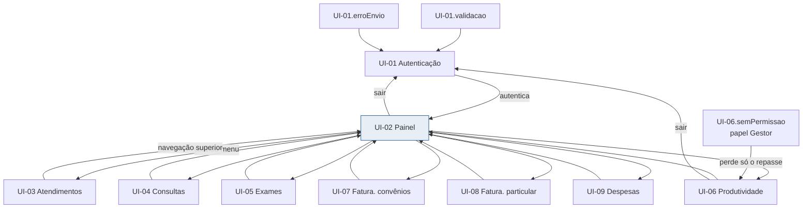

# SPEC-UI-001: Painel de Indicadores de Saúde — MVP com dados demonstrativos

> **PRD de referência:** `docs/prds/PRD-001-painel-indicadores-saude.md`
> **Arquitetura de referência:** `docs/architecture/proposta-arquitetural.md`
> **Modo:** Geração
> **Artefato visual:** `docs/prototype/wireframe/index.html` (9 telas HTML, wireframe navegável)
> **Fidelidade:** Wireframe
> **Autor:** Anderson (via skill `prototype-leanwork`)
> **Data:** 2026-09-26
> **Status:** Aprovado em 2026-09-26. Lacunas 1, 2, 3 e 10 decididas; demais com aceite explícito pendente.

---

## 1. Contexto de interface

**Arquétipo:** Admin / Dashboard — gestores internos, uso frequente e prolongado, sete indicadores de alto volume de dado.

**Dispositivo alvo:** Desktop-first responsivo. O gestor lê gráficos comparativos no desktop; abaixo de 900 px a grade
de cards e gráficos reorganiza em coluna única. Confirmado na entrevista.

**Stack de frontend:** ASP.NET Core Razor Pages .NET 10 + Bootstrap 5 + Chart.js local (ADR-006). Sem SPA, sem React,
sem etapa de build de frontend. A interface é renderizada no servidor e o JavaScript apenas lê ilhas JSON para desenhar
gráficos.

**Fidelidade do protótipo:** wireframe. Nenhuma skill de design de interface estava disponível no ambiente, então o
protótipo cobre estrutura, campos, navegação e estados, sem tratamento visual final. Os valores de cor abaixo são
propostos, extraídos da direção visual escolhida (C — corporativa sóbria) e **não** são marca do cliente.

**Origem das informações deste documento:**

| Fonte | O que veio dela |
|---|---|
| Protótipo | 9 telas, 44 estados, campos de filtro, rotas, hierarquia de layout, componentes repetidos |
| PRD | Personas, 27 critérios de aceite, 47 regras de negócio, tabela de permissionamento, mapa indicador × dimensão |
| Arquitetura | Stack, ADR-005 (Identity), ADR-006 (Chart.js local), ADR-004 (somente leitura) |
| Entrevista | Arquétipo, dispositivo primário, fidelidade, direção visual |
| Repositório | Nada. Projeto greenfield: nenhum `.cshtml`, `.razor`, `.csproj` ou design system pré-existente |

---

## 2. Tokens de design

Valores **propostos** para o wireframe. Não há marca do cliente nem design system no repositório. Se a direção visual
mudar, esta seção é substituída — não é contrato.

| Token | Valor | Origem |
|---|---|---|
| Primária | `#1a4e8a` | Direção visual C, proposta na entrevista |
| Primária forte | `#123a68` | Derivada da primária |
| Primária fraca | `#e8eef6` | Derivada da primária |
| Superfície | `#f4f6f8` | Idem |
| Cartão | `#ffffff` | Idem |
| Borda | `#d3dae2` | Idem |
| Borda forte | `#9aa8b6` | Idem |
| Erro | `#b3261e` | Idem |
| Alerta (badge demo) | `#8a5a00` sobre `#fff4d6` | Idem — cor reservada ao badge de origem demonstrativa |
| Positivo / negativo | `#1e6b34` / `#b3261e` | Idem — variação do indicador |
| Fonte base | `-apple-system, Segoe UI, Roboto, …` | Bootstrap 5, que é a biblioteca obrigatória |
| Escala de espaçamento | 4 px | Bootstrap 5 |

> O badge de origem demonstrativa (RN-02) é o único elemento com cor de alerta no produto. Ele não é decoração: é
> requisito de negócio, e por isso tem cor reservada e não compete com a cor de erro.

---

## 3. Inventário de telas

| ID | Tela | Rota | Persona | Implementa (RN) | Valida (CA) |
|---|---|---|---|---|---|
| UI-01 | Autenticação | `/Identity/Account/Login` | Todos | RN-17 | CA-10 |
| UI-02 | Painel de indicadores | `/` | Gestor, Administrador | RN-01, RN-02, RN-07, RN-08, RN-09, RN-12, RN-13, RN-14, RN-15, RN-30 | CA-01, CA-03, CA-04, CA-05, CA-07, CA-08, CA-09, CA-26, CA-27 |
| UI-03 | Atendimentos | `/Indicadores/Atendimentos` | Gestor, Administrador | RN-02, RN-07, RN-11, RN-12, RN-20, RN-21, RN-22, RN-23 | CA-01, CA-05, CA-06, CA-13, CA-14, CA-27 |
| UI-04 | Consultas | `/Indicadores/Consultas` | Gestor, Administrador | RN-02, RN-07, RN-11, RN-12, RN-24, RN-25, RN-26 | CA-01, CA-15, CA-16, CA-27 |
| UI-05 | Exames | `/Indicadores/Exames` | Gestor, Administrador | RN-02, RN-07, RN-11, RN-12, RN-27, RN-28, RN-29 | CA-01, CA-17, CA-27 |
| UI-06 | Produtividade médica | `/Indicadores/Produtividade` | Gestor (parcial), Administrador | RN-02, RN-07, RN-18, RN-30, RN-31, RN-32, RN-33, RN-35, RN-36 | CA-01, CA-03, CA-11, CA-12, CA-18, CA-19, CA-20, CA-27 |
| UI-07 | Faturamento por convênios | `/Indicadores/FaturamentoConvenios` | Gestor, Administrador | RN-02, RN-07, RN-11, RN-12, RN-37, RN-38, RN-39, RN-40, RN-41 | CA-01, CA-21, CA-22, CA-27 |
| UI-08 | Faturamento particular | `/Indicadores/FaturamentoParticular` | Gestor, Administrador | RN-02, RN-07, RN-11, RN-12, RN-42, RN-43, RN-44 | CA-01, CA-23, CA-27 |
| UI-09 | Despesas | `/Indicadores/Despesas` | Gestor, Administrador | RN-02, RN-07, RN-12, RN-45, RN-46 | CA-01, CA-24, CA-25, CA-27 |

**Total:** 9 telas, 42 estados, 13 componentes reutilizáveis.

### Decisões registradas na fase de revisão

| # | Lacuna | Decisão | Base |
|---|---|---|---|
| 1 | Categoria de despesa em `UI-09` | **Etapa 1 entrega só o total por período.** Sem filtro de categoria, sem tabela por categoria, sem participação, sem gráfico de composição. A categoria e o rateio entram na Etapa 2. | RN-46 já condiciona a categoria a "quando a categoria existir"; RN-47 é `[PENDENTE]` |
| 2 | Gráfico de `UI-06` com 23 séries | **Top 6 por volume no período**, com o filtro de Médico como seletor: ao escolher um profissional, o gráfico mostra a série dele isolada. | RN-31 exige recorte por médico e evolução temporal, sem exigir uma série por médico |
| 3 | Rótulo "Médico" em `UI-05` | **Rótulo neutro "Médico", sem qualificador de função.** A atribuição semântica — solicitante, executor, responsável ou outra — permanece `[PENDENTE]` para a Etapa 2, e a tela declara isso. O filtro agrupa pelo atributo `medico` da entidade demonstrativa, por coincidência de nomenclatura com a palavra de RN-28; `medicoSolicantante` fica sem uso, reservado. | RN-28 diz apenas "por médico". `RN-04` proíbe preencher por suposição. A definição de exame é `RN-29`, não `RN-28` |
| 4 | Acessibilidade não declarada na arquitetura nem no PRD | **Operabilidade básica como requisito do MVP: todo campo com rótulo associado e toda tarefa concluível por teclado.** Contraste medido e conformidade formal com WCAG 2.1/2.2 AA ficam fora do escopo da Etapa 1. | Decisão de produto registrada; a certificação formal depende de decisão institucional e de auditoria, e a direção visual ainda é proposta |

---

## 4. Telas em detalhe

### UI-01 — Autenticação

**Propósito:** autenticar o usuário para liberar o acesso a qualquer indicador.

**Rota:** `/Identity/Account/Login` (Identity padrão do ASP.NET Core, ADR-005)

**Persona:** todos. É a única tela acessível sem papel definido.

**Regras que se manifestam:**

| Regra | Como aparece na tela |
|---|---|
| RN-17 | A tela existe como porta de entrada; nenhum indicador é carregado antes da autenticação |

**Estados:**

| Estado | ID | Quando ocorre | O que o usuário vê | Origem |
|---|---|---|---|---|
| Padrão | `UI-01.default` | Formulário em repouso | E-mail, senha, botão Entrar | Protótipo |
| Validação | `UI-01.validacao` | Credencial recusada | Alerta "E-mail ou senha inválidos" + borda nos campos; valores preservados | Derivado do PRD |
| Enviando | `UI-01.enviando` | Autenticação em andamento | Campos e botão desabilitados, rótulo "Entrando…" | Derivado do PRD |
| Erro de envio | `UI-01.erroEnvio` | Falha no serviço de autenticação | Alerta de indisponibilidade + "Tentar novamente"; e-mail e senha preservados | Derivado do PRD |

**Elementos principais:**

- Campo de e-mail e campo de senha, ambos com rótulo associado
- Botão Entrar, desabilitado durante o envio
- Nenhum link de "criar conta" ou "esqueci minha senha" — ver lacuna 4

**Navegação:**

- Autenticação com sucesso → `UI-02`
- "Sair" no topo das demais telas → `UI-01`

**Observações:** não há estado `.sucesso`: o sucesso é um redirecionamento, não uma tela. A mensagem de credencial
inválida não revela se o e-mail existe. A tela não exibe o badge de dado demonstrativo porque não exibe indicador.

---

### UI-02 — Painel de indicadores

**Propósito:** mostrar os sete indicadores do período com comparação e atalho para o detalhamento de cada um.

**Rota:** `/`

**Persona:** Gestor e Administrador. Nenhum conteúdo da tela é restrito por papel.

**Regras que se manifestam:**

| Regra | Como aparece na tela |
|---|---|
| RN-01, RN-02 | Badge "Dados demonstrativos — regras reais pendentes de validação" no topo, antes de qualquer número |
| RN-07 | Campos de data inicial e final, com o intervalo aplicado a todos os indicadores da tela |
| RN-08 | Botão "Últimos 12 meses" e período visível no filtro |
| RN-09 | Nota sob o filtro declarando o intervalo semiaberto |
| RN-13 | Paríodo anterior calculado e exibido em texto: mesmo número de dias, encerrando no dia anterior ao início |
| RN-14 | Cada card traz variação percentual e variação absoluta; a base aparece no rodapé do card |
| RN-15 | Duas opções de comparação, sendo a primeira o padrão |
| RN-12, RN-14 | No estado `.vazio`, o valor é `0` e a comparação é `—` |
| RN-30 | O card de Produtividade médica mostra o número sob o nome de negócio e, abaixo, "Métrica provisória: atendimentos por médico" |

**Estados:**

| Estado | ID | Quando ocorre | O que o usuário vê | Origem |
|---|---|---|---|---|
| Padrão | `UI-02.default` | Período com dados | Filtro de período, 7 cards, gráfico de linha, donut de participação, tabela de resumo | Protótipo |
| Carregando | `UI-02.carregando` | Consulta em andamento | Skeleton de 7 cards, 2 gráficos e tabela; nenhum número exibido | Derivado do PRD |
| Vazio | `UI-02.vazio` | Período sem registros | 7 cards com `0`, comparação `—`, bloco "Sem registros no período" com ação de retorno | Derivado de CA-07 |
| Erro | `UI-02.erro` | Falha da fonte de dados | Mensagem de tela inteira + "Tentar novamente"; nenhum indicador parcial | Derivado do PRD |

**Elementos principais:**

- Badge de origem demonstrativa
- Barra de período com "Últimos 12 meses" e "Aplicar"
- Chave de comparação com duas opções
- Sete cards de indicador, cada um com link para a tela de detalhamento
- Gráfico de linha (evolução de atendimentos) e donut (participação por convênio)
- Tabela de resumo com período atual, período anterior, variação % e variação absoluta

**Navegação:**

- Card "Ver detalhamento" → `UI-03` a `UI-09`, conforme o indicador
- Item da navegação superior → `UI-03` a `UI-09`

**Observações:** a tela **não** tem estado `.semPermissao` porque nenhum de seu elementos é restrito por papel — dado
individual e repasse ficam em `UI-06`. A distinção entre `.vazio` e `.erro` é regra de negócio disfarçada de UI: zero é
resposta válida, "não consegui consultar" não pode aparecer como zero.

---

### UI-03 — Atendimentos

**Propósito:** detalhar o volume de atendimentos com recortes por tipo, sexo, convênio e médico.

**Rota:** `/Indicadores/Atendimentos`

**Persona:** Gestor e Administrador.

**Regras que se manifestam:**

| Regra | Como aparece na tela |
|---|---|
| RN-20 | Card de total com o valor e a variação |
| RN-21 | Quatro filtros de categoria e um seletor "Agrupar por" com as mesmas quatro dimensões |
| RN-11 | Filtros aplicados por conjunção, declarado em texto sob o formulário |
| RN-22, RN-23 | Aviso de que o que conta como atendimento e a disponibilidade das dimensões são pendentes |
| RN-02 | Badge de origem demonstrativa |

**Estados:**

| Estado | ID | Quando ocorre | O que o usuário vê | Origem |
|---|---|---|---|---|
| Padrão | `UI-03.default` | Período e filtros com retorno | Card total, contador de filtros ativos, linha, donut, tabela agrupada com total | Protótipo |
| Carregando | `UI-03.carregando` | Consulta em andamento | Skeleton de filtros, cards, gráficos e tabela | Derivado do PRD |
| Vazio | `UI-03.vazio` | Período sem registros | Card com `0` e ação de retorno ao período padrão | Derivado de CA-07 |
| Vazio por filtro | `UI-03.vazioFiltro` | Período tem dados, combinação de filtros não | Bloco "Nenhum resultado para os filtros selecionados" + "Limpar filtros", com o períodoalone declarado | Derivado do PRD |
| Erro | `UI-03.erro` | Falha da consulta | Mensagem + "Tentar novamente"; filtros preservados | Derivado do PRD |

**Elementos principais:**

- Filtros: tipo de atendimento, sexo, convênio, médico
- Seletor "Agrupar por" com tipo, sexo, convênio e médico
- Card de total, com contador de filtros ativos e ação de limpar
- Tabela agrupada com linha de total, cujas colunas somam ao card

**Navegação:**

- Navegação superior → `UI-02`, `UI-04` a `UI-09`
- "Limpar filtros" permanece na tela

**Observações:** o estado `.vazioFiltro` diz explicitamente que o período tem 18.402 atendimentos, para que o gestor
distinga "não há dado" de "não há resultado para o filtro".

---

### UI-04 — Consultas

**Propósito:** detalhar o total de consultas com recortes por sexo, convênio e médico.

**Rota:** `/Indicadores/Consultas`

**Persona:** Gestor e Administrador.

**Regras que se manifestam:**

| Regra | Como aparece na tela |
|---|---|
| RN-24 | Card de total com o valor e a variação |
| RN-25 | Três filtros — sexo, convênio, médico — e **nenhum** filtro de tipo de atendimento |
| RN-25 | Selo "Tipo de atendimento: Consulta (fixo neste indicador — não é um filtro)" |
| RN-11, RN-12 | Filtros cumulativos e estado vazio |
| RN-26 | Aviso de que a definição de consulta é pendente |

**Estados:** `UI-04.default`, `UI-04.carregando`, `UI-04.vazio`, `UI-04.vazioFiltro`, `UI-04.erro` — mesma
estrutura de `UI-03`.

**Elementos principais:**

- Selo de tipo fixo, acima dos filtros
- Filtros: sexo, convênio, médico
- Seletor "Agrupar por" com sexo, convênio e médico — **sem** tipo
- Card de total, donut por sexo, tabela por convênio

**Observações:** a ausência do filtro de tipo é o requisito de CA-16. Oferecer a dimensão sugeriria que o gestor pode
alterá-la; o selo informa o valor fixo sem criar a expectativa de controle.

---

### UI-05 — Exames

**Propósito:** detalhar o total de exames com recortes por sexo, convênio e médico.

**Rota:** `/Indicadores/Exames`

**Persona:** Gestor e Administrador.

**Regras que se manifestam:**

| Regra | Como aparece na tela |
|---|---|
| RN-27 | Card de total com o valor e a variação |
| RN-28 | Três filtros — sexo, convênio, médico (rótulo neutro, com a atribuição semântica declarada como pendente na tela) |
| RN-29 | Aviso de que solicitado × realizado não é distinguível, e anotação sobre o rótulo ambíguo de "médico" |
| RN-02 | Badge de origem demonstrativa |

**Estados:** `UI-05.default`, `UI-05.carregando`, `UI-05.vazio`, `UI-05.vazioFiltro`, `UI-05.erro`.

**Observações:** ver decisão 3 na seção 3. O rótulo permanece "Médico", sem qualificador de função, e a tela declara que a
atribuição semântica — solicitante, executor, responsável ou outra — é `[PENDENTE]` para a Etapa 2. O filtro da Etapa 1
agrupa pelo atributo `medico` do conjunto demonstrativo, por coincidência de nomenclatura com a palavra de RN-28;
`medicoSolicitante` existe no conjunto e fica sem uso, reservado para a descoberta.

---

### UI-06 — Produtividade médica

**Propósito:** mostrar a produção por profissional e, para o Administrador, os valores de repasse.

**Rota:** `/Indicadores/Produtividade`

**Persona:** Gestor (sem repasse) e Administrador (com repasse).

**Regras que se manifestam:**

| Regra | Como aparece na tela |
|---|---|
| RN-30 | Aviso de métrica provisória no topo da tela, repetido no card — "não é produtividade" |
| RN-31 | Gráfico de linha mensal com as 6 séries de maior volume no período, e tabela com uma coluna por mês |
| RN-32 | Tabela de repasse, presente apenas no estado `.default` |
| RN-18 | No estado `.semPermissao`, a tabela de repasse é substituída por aviso de acesso restrito, sem nenhum valor |
| RN-33, RN-35, RN-36 | Avisos de que critério de produtividade e competência de repasse são pendentes |
| RN-02 | Badge de origem demonstrativa |

**Estados:**

| Estado | ID | Quando ocorre | O que o usuário vê | Origem |
|---|---|---|---|---|
| Padrão (Administrador) | `UI-06.default` | Usuário com papel Administrador | Tela completa + tabela de repasse | Protótipo |
| Sem permissão (Gestor) | `UI-06.semPermissao` | Usuário com papel Gestor | Tela sem a tabela de repasse; no lugar, aviso "Acesso restrito" | Derivado de CA-11 |
| Carregando | `UI-06.carregando` | Consulta em andamento | Skeleton; o aviso de métrica provisória permanece visível | Derivado do PRD |
| Vazio | `UI-06.vazio` | Período sem atendimentos | Bloco "Nenhum atendimento no período" | Derivado de CA-07 |
| Erro | `UI-06.erro` | Falha da consulta | Mensagem + "Tentar novamente" | Derivado do PRD |

**Elementos principais:**

- Aviso de métrica provisória, antes de qualquer número
- Filtros de período e médico
- Gráfico de linha do Top 6 e gráfico de barras de top 6
- Tabela mensal por profissional, com total
- Tabela de repasse, condicionada ao papel

**Observações:** a restrição de `RN-18` é do **elemento**, não da tela — o Gestor continua vendo a produção por
profissional e perde apenas o repasse. Decisão registrada na seção 3. O aviso de métrica provisória
aparece também no estado `.carregando`, porque a advertência não pode depender de os dados já terem chegado.

---

### UI-07 — Faturamento por convênios

**Propósito:** mostrar o faturamento por convênio e a participação percentual de cada um.

**Rota:** `/Indicadores/FaturamentoConvenios`

**Persona:** Gestor e Administrador.

**Regras que se manifestam:**

| Regra | Como aparece na tela |
|---|---|
| RN-37 | Card de total, barras por convênio e tabela com valores por convênio |
| RN-38 | Donut de participação e coluna "Participação" na tabela, somando 100% |
| RN-39 | Filtros de convênio e tipo de atendimento; sem sexo e sem médico |
| RN-40, RN-41 | Aviso de que o que é faturamento, qual competência e o tratamento de glosa são pendentes |
| RN-11, RN-12 | Filtros cumulativos e estados vazio e vazio por filtro |

**Estados:** `UI-07.default`, `UI-07.carregando`, `UI-07.vazio`, `UI-07.vazioFiltro`, `UI-07.erro`.

**Observações:** no estado `.vazio` a participação percentual **não** é exibida, porque dividir por um total zero não
tem resposta. É a diferença entre "0%" e "não calculável".

---

### UI-08 — Faturamento particular

**Propósito:** mostrar o faturamento de atendimentos particulares, separado do faturamento de convênios.

**Rota:** `/Indicadores/FaturamentoParticular`

**Persona:** Gestor e Administrador.

**Regras que se manifestam:**

| Regra | Como aparece na tela |
|---|---|
| RN-42 | Card de total, com participação no faturamento total |
| RN-43 | Filtros de tipo de atendimento e médico; sem sexo e sem convênio |
| RN-44 | Aviso de que a representação de "Particular" no banco real é pendente |
| RN-11, RN-12 | Filtros cumulativos e estados vazio e vazio por filtro |

**Estados:** `UI-08.default`, `UI-08.carregando`, `UI-08.vazio`, `UI-08.vazioFiltro`, `UI-08.erro`.

**Observações:** o donut desta tela compara particular com convênios, e não detalha a composição do particular — é a
única tela em que o gráfico responde a uma pergunta que não é o próprio indicador.

---

### UI-09 — Despesas

**Propósito:** mostrar as despesas do serviço no período, com dimensionalidade reduzida.

**Rota:** `/Indicadores/Despesas`

**Persona:** Gestor e Administrador.

**Regras que se manifestam:**

| Regra | Como aparece na tela |
|---|---|
| RN-45 | Card de total e linha de evolução mensal |
| RN-46 | Apenas período; sem sexo, sem paciente, sem médico e **sem categoria**, declarado em texto sob o filtro |
| RN-47 | Sem manifestação na Etapa 1 — o aviso de deferência explica por quê |
| RN-02 | Badge de origem demonstrativa |

**Estados:**

| Estado | ID | Quando ocorre | O que o usuário vê | Origem |
|---|---|---|---|---|
| Padrão | `UI-09.default` | Período com despesas | Card total, média mensal, mês mais alto, linha de evolução e aviso de deferência | Protótipo |
| Carregando | `UI-09.carregando` | Consulta em andamento | Skeleton | Derivado do PRD |
| Vazio | `UI-09.vazio` | Período sem despesas | Card com `R$ 0,00` e ação de retorno | Derivado de CA-07 |
| Erro | `UI-09.erro` | Falha da consulta | Mensagem + "Tentar novamente" | Derivado do PRD |

**Observações:** esta é a única tela de indicador com um único estado não vazio além de carregamento — não há
`.vazioFiltro` porque não existe filtro além do período, e não há `.semCategoria` porque a categoria foi deferida
(três card de detalhe saíram). Os cards "Média mensal" e "Mês mais alto" são leitura direta do mesmo total de RN-45, não
indicadores novos. O card "Resultado do período" foi removido: era faturamento menos despesas, uma subtração sem RN e
sem CA. Se o cliente o quiser, ele precisa entrar no PRD primeiro.

---

## 5. Componentes reutilizáveis

| Componente | Usado em | Descrição | Estados |
|---|---|---|---|
| `BadgeDemo` | UI-02 a UI-09 | Faixa de origem demonstrativa, com selo "Demo" | único |
| `TopoUsuario` | UI-02 a UI-09 | Nome, papel atual e ação de sair | autenticado |
| `BarraPeriodo` | UI-02 a UI-09 | Datas, ação "Últimos 12 meses" e "Aplicar" | default, enviando |
| `ChaveComparacao` | UI-02 | Duas opções de comparação | anterior (padrão), ano anterior |
| `BarraFiltros` | UI-03 a UI-08 | Conjunto de dimensões do indicador, variando por tela | default, condicional |
| `CardIndicador` | UI-02 a UI-09 | Valor do período, variação percentual e absoluta, link de detalhamento | default, base zero (mostra `—`) |
| `GraficoLinha` | UI-02 a UI-09 | Série temporal | default, carregando |
| `GraficoBarras` | UI-02, UI-06 | Comparativo por categoria ou por profissional | default, carregando |
| `GraficoDonut` | UI-02, UI-03, UI-04, UI-05, UI-07, UI-08 | Participação percentual | default, sem fatia (total zero) |
| `TabelaDetalhe` | UI-02 a UI-08 | Tabela com linha de total | default, carregando |
| `AvisoRestrito` | UI-06 | Bloqueio de acesso a elemento | único |
| `BlocoEstado` | UI-01 a UI-09 | Vazio, erro e sem permissão, com ação | vazio, porFiltro, erro, semPermissao |
| `Esqueleto` | UI-02 a UI-09 | Placeholder de carregamento | único |

---

## 6. Fluxo de navegação

Não há drill-down de segundo nível: clicar em um profissional, convênio ou categoria **não** abre outra tela. O PRD não
descreve esse nível, e a SPEC-UI não o inventa — ver lacuna 7.

---

## 7. Cobertura do PRD

Verificação cruzada na direção inversa: percorreu-se o PRD procurando regra e cenário sem onde acontecer.

### Regras de negócio

| RN | Manifesta em | Status |
|---|---|---|
| RN-01 | UI-02 a UI-09 (badge e avisos) | ✅ Coberta |
| RN-02 | UI-02 a UI-09 (`BadgeDemo`) | ✅ Coberta |
| RN-03 | — | ⚠️ Regra de processo — proíbe promover cálculo a regra; sem manifestação em tela |
| RN-04 | — | ⚠️ Regra de processo — pendência registrada no próprio PRD |
| RN-05 | — | ⚠️ Regra de processo da Etapa 2 |
| RN-06 | — | ⚠️ Regra de backend — o seed não tem tela |
| RN-07 | UI-02 a UI-09 (`BarraPeriodo`) | ✅ Coberta |
| RN-08 | UI-02.default | ✅ Coberta |
| RN-09 | UI-02.default (nota do intervalo semiaberto) | ✅ Coberta |
| RN-10 | — | ❌ Sem manifestação — `[PENDENTE]`, data de referência real desconhecida |
| RN-11 | UI-03 a UI-09 (`BarraFiltros`, `.vazioFiltro`) | ✅ Coberta |
| RN-12 | `.vazio` de UI-02 a UI-09 | ✅ Coberta |
| RN-13 | UI-02.default (período anterior calculado) | ✅ Coberta |
| RN-14 | `CardIndicador` em todas as telas com indicador | ✅ Coberta |
| RN-15 | UI-02.default (`ChaveComparacao`) | ✅ Coberta |
| RN-16 | — | ❌ Sem manifestação — `[PENDENTE]`, significado gerencial da comparação |
| RN-17 | UI-01 | ✅ Coberta |
| RN-18 | UI-06 (`.default` e `.semPermissao`) | ✅ Coberta |
| RN-19 | UI-06 (`.semPermissao`) | ◐ Parcial — só o mínimo declarado; a política real é `[PENDENTE]` |
| RN-20 | UI-03 | ✅ Coberta |
| RN-21 | UI-03 (quatro dimensões) | ✅ Coberta |
| RN-22 | UI-03 (aviso) | ◐ Parcial — a regra é `[PENDENTE]`; a tela declara a pendência |
| RN-23 | UI-03, UI-05 (aviso e anotação) | ◐ Parcial — idem RN-22 |
| RN-24 | UI-04 | ✅ Coberta |
| RN-25 | UI-04 (selo de tipo fixo e ausência do filtro) | ✅ Coberta |
| RN-26 | UI-04 (aviso) | ◐ Parcial — `[PENDENTE]` |
| RN-27 | UI-05 | ✅ Coberta |
| RN-28 | UI-05 | ✅ Coberta |
| RN-29 | UI-05 (aviso e anotação) | ◐ Parcial — `[PENDENTE]` |
| RN-30 | UI-02.default, UI-06 (aviso e card) | ✅ Coberta |
| RN-31 | UI-06.default (linha do Top 6 e tabela mensal) | ✅ Coberta |
| RN-32 | UI-06.default (tabela de repasse) | ✅ Coberta |
| RN-33 | UI-06 (aviso de métrica provisória) | ◐ Parcial — o critério real é `[PENDENTE]` |
| RN-34 | — | ❌ Sem manifestação — `[PENDENTE]`, composição da produção médica |
| RN-35 | UI-06 (nota de competência) | ◐ Parcial — `[PENDENTE]` |
| RN-36 | UI-06 (aviso) | ◐ Parcial — vale na Etapa 2 |
| RN-37 | UI-07 | ✅ Coberta |
| RN-38 | UI-07 (donut e coluna de participação) | ✅ Coberta |
| RN-39 | UI-07 (`BarraFiltros`) | ✅ Coberta |
| RN-40 | UI-07 (aviso) | ◐ Parcial — `[PENDENTE]` |
| RN-41 | UI-07 (aviso) | ◐ Parcial — `[PENDENTE]` |
| RN-42 | UI-08 | ✅ Coberta |
| RN-43 | UI-08 (`BarraFiltros`) | ✅ Coberta |
| RN-44 | UI-08 (aviso) | ◐ Parcial — `[PENDENTE]` |
| RN-45 | UI-09 | ✅ Coberta |
| RN-46 | UI-09 (ausência de sexo, paciente e médico) | ✅ Coberta |
| RN-47 | — | ❌ Sem manifestação na Etapa 1 — deferida para a Etapa 2, por decisão registrada e por RN-46 |

**Resumo:** 28 cobertas, 11 parciais — todas parciais por serem `[PENDENTE]` —, 4 sem manifestação por serem regra de
processo ou de backend, e 4 sem manifestação por serem `[PENDENTE]` sem contrapartida visual possível. Total: 47.

### Cenários Gherkin

| CA | Acontece em | Status |
|---|---|---|
| CA-01 | UI-02 a UI-09, `BadgeDemo` | ✅ Coberto |
| CA-02 | — | ⚠️ Cenário de backend — valida o seed; não tem tela por natureza |
| CA-03 | UI-02.default (card de produtividade), UI-06 (aviso) | ✅ Coberto |
| CA-04 | UI-02.default | ✅ Coberto |
| CA-05 | UI-02 a UI-09 | ✅ Coberto |
| CA-06 | UI-03.default | ✅ Coberto |
| CA-07 | `.vazio` de UI-02 a UI-09 | ✅ Coberto |
| CA-08 | UI-02.default | ✅ Coberto |
| CA-09 | UI-02.default (`ChaveComparacao`) | ✅ Coberto |
| CA-10 | UI-01 | ✅ Coberto |
| CA-11 | UI-06.semPermissao | ✅ Coberto |
| CA-12 | UI-06.default | ✅ Coberto |
| CA-13 | UI-03 | ✅ Coberto |
| CA-14 | UI-03 (seletor "Agrupar por") | ✅ Coberto |
| CA-15 | UI-04 | ✅ Coberto |
| CA-16 | UI-04 (ausência do filtro de tipo) | ✅ Coberto |
| CA-17 | UI-05 | ✅ Coberto |
| CA-18 | UI-06 (aviso de métrica provisória) | ✅ Coberto |
| CA-19 | UI-06 (linha do Top 6 e tabela mensal) | ✅ Coberto |
| CA-20 | UI-06.default (tabela de repasse) | ✅ Coberto |
| CA-21 | UI-07 | ✅ Coberto |
| CA-22 | UI-07 (donut e coluna de participação) | ✅ Coberto |
| CA-23 | UI-08 | ✅ Coberto |
| CA-24 | UI-09 | ✅ Coberto |
| CA-25 | UI-09 (ausência das três dimensões) | ✅ Coberto |
| CA-26 | UI-02.default (cards, gráficos e tabelas) | ✅ Coberto |
| CA-27 | Todas as telas, por construção responsiva da grade | ✅ Coberto |

**Nenhum cenário de aceite ficou sem tela.** O único caso sem representação é CA-02, que valida o conjunto de dados do
seed e, por natureza, não acontece em interface.

---

## 8. Lacunas e pendências

As lacunas 1, 2, 3 e 10 foram decididas com o responsável pelo produto e estão registradas na seção 3. As demais precisam de
aceite explícito — como fora de escopo da Etapa 1 — antes do plano de execução.

| # | Lacuna | Impacto | Decisão necessária |
|---|---|---|---|
| 1 | **Filtro por categoria de despesa depende de RN-47**, que é `[PENDENTE]` | Altera o layout de `UI-09` e a quantidade de estados | ✅ **Decidido** — Etapa 1 entrega só o total por período; categoria e rateio ficam para a Etapa 2 |
| 2 | **Gráfico de `UI-06` com 23 séries** | 23 linhas no mesmo eixo ficam ilegíveis | ✅ **Decidido** — Top 6 por volume no período, com o filtro de Médico como seletor |
| 3 | **Rótulo "Médico" em `UI-05` era ambíguo** | O gestor não sabe se é solicitante, executor ou responsável pelo exame | **DECIDIDA** - ver seção 3, decisão 3: rótulo neutro "Médico", atribuição semântica `[PENDENTE]` para a Etapa 2 |
| 4 | **Não há tela de gerenciamento de usuários e papéis** | O PRD declara fora de escopo, mas o sistema precisa de usuários para o login funcionar | Confirmar que o seed do Identity é a origem única na Etapa 1 |
| 5 | **Filtro não é salvo nem compartilhável por URL** | O gestor perde o recorte a cada acesso; não há como mandar "olha esse período" para um colega | Deixar fora com aceite explícito, ou incluir estado na URL |
| 6 | **Não há exportação nem impressão** | O dashboard não substitui o relatório que o gestor usa hoje para levar a reunião | Deixar fora com aceite explícito |
| 7 | **Não há drill-down de segundo nível** | Clicar em um profissional, convênio ou categoria não abre detalhe | Deixar fora com aceite explícito, ou criar telas de detalhe no PRD |
| 8 | **Estado de sessão expirada durante o uso** não está modelado | O usuário pode receber um redirecionamento no meio de um filtro longo | Modelar redirecionamento com retorno ao período, ou aceitar o comportamento padrão do Identity |
| 9 | **Textos de erro não foram validados por design** | Derivados do PRD, sem aprovação visual | Validar antes de implementar, ou aceitar como texto provisório |
| 10 | **Acessibilidade não é declarada na arquitetura nem no PRD** | Sem rótulo, foco e navegação por teclado especificados, cada dev decide | **DECIDIDA** - ver seção 3, decisão 4: rótulo associado e operabilidade por teclado como requisito do MVP; contraste medido e certificação WCAG AA fora do escopo |
| 11 | **Tokens de cor são propostos, não validados** | A direção visual pode mudar depois de implementada | Aceitar como premissa da Etapa 1 |
| 12 | **O card "Resultado do período" foi removido de `UI-09`** | Era faturamento menos despesas, sem RN e sem CA | Confirmar a remoção. Se o cliente o quiser, ele entra no PRD antes de entrar no plano |

---

## 9. Restrições de interface

Extraídas da arquitetura e do PRD:

- **Bootstrap 5 é a biblioteca obrigatória.** Nenhum outro framework de componentes pode ser introduzido.
- **Chart.js local, alimentado por ilhas JSON.** Sem CDN, sem build de frontend, sem etapa de bundling (ADR-006).
- **Sem SPA e sem React.** A seleção de período e a normalização do intervalo são resolvidas no servidor, em um único
  ponto, para que todos os indicadores da tela interpretem o mesmo recorte (RN-09).
- **O badge de origem demonstrativa é obrigatório em toda tela com indicador** (RN-02). Não há como suprimi-lo por
  configuração.
- **Indicador sem significado não oferece a dimensão.** A ausência é explícita na tela, nunca silenciosa.
- **`.vazio` e `.erro` são estados distintos e obrigatórios** em toda tela que busca dados. Erro não pode ser
  apresentado como zero.
- **A restrição de papel é do elemento, não da tela.** `UI-06` continua acessível ao Gestor sem o repasse.
- **Fidelidade de wireframe.** Nenhuma skill de design de interface estava disponível; o protótipo não serve de
  referência visual final.
- **Acessibilidade: requisito de MVP, sem certificação formal.** Todo campo de formulário tem rótulo associado e toda tarefa
  é concluível por teclado, com foco visível. Contraste medido e conformidade formal com WCAG 2.1/2.2 AA **não** fazem
  parte da Etapa 1 — dependem de auditoria e de decisão institucional. Decisão registrada — lacuna 10.
